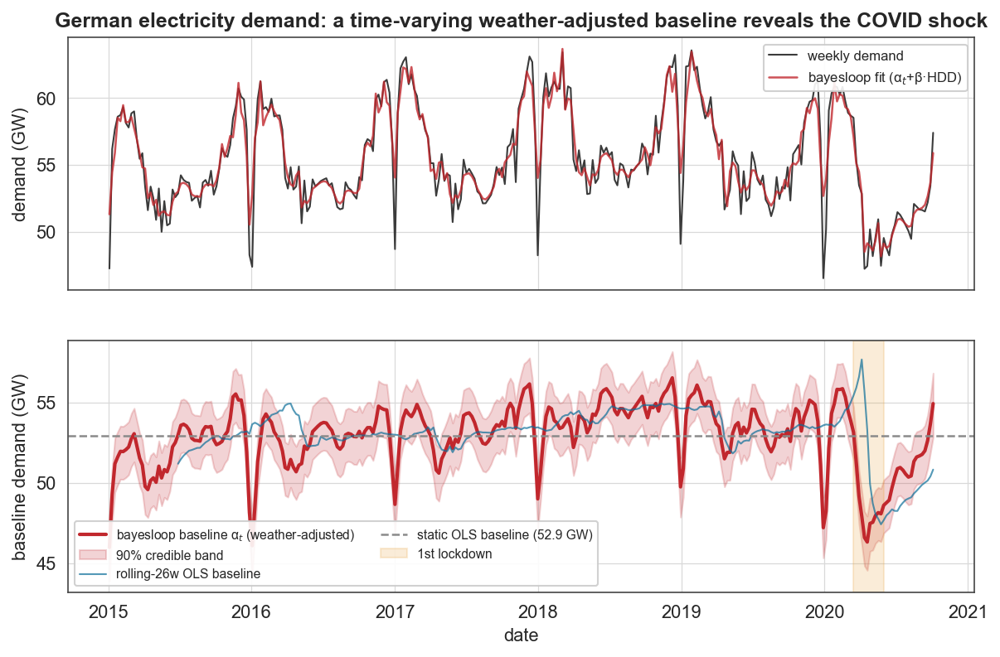
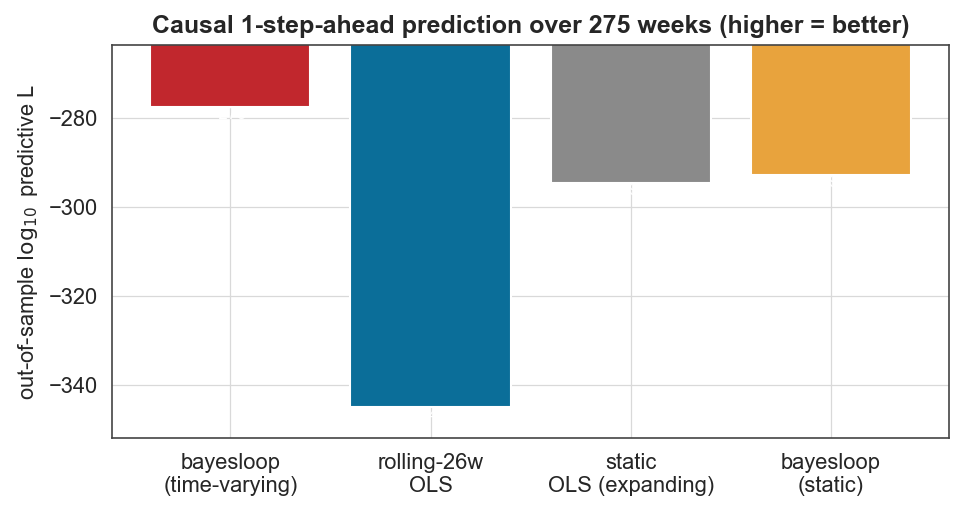

# Case study 10 — Energy
## The weather-adjusted baseline of national electricity demand — and the COVID shock a static model can't see

**Field:** Energy systems / load analysis · **bayesloop features:** custom `NumPy` regression observation model, **time-varying regression coefficient** (`GaussianRandomWalk` on the intercept), `HyperStudy` (auto-tuned smoothness), model evidence, `OnlineStudy` (causal out-of-sample scoring) · **Established models it beats:** static weather-normalisation regression and rolling-window OLS, on model evidence *and* out-of-sample prediction · **Data:** German electricity load (OPSD / ENTSO-E) + Berlin temperature (Open-Meteo), weekly, 2015–2020.

---

### 1. The established approach, and its blind spot

Utilities and system operators "weather-normalise" demand with a **degree-day regression**:

  demandₜ = α + β · HDDₜ + noise,   HDD = max(0, 15 °C − temperatureₜ),

where α is the **weather-independent baseline** and β the heating sensitivity. In standard practice the coefficients are **constant** (or re-fit per period, or in a rolling window). The blind spot is obvious in hindsight: the baseline is *not* constant. When the spring-2020 lockdown shut commerce and industry, baseline demand fell — and a constant-coefficient model has nowhere to put that except its residuals.

Fitting the static model confirms it: it leaves a **−5.1 GW average residual across spring 2020** (vs ≈ 0 in 2018 and 2019) — a structural break it represents only as "error", with an overall unexplained scatter of **2.75 GW**.

### 2. The bayesloop model

Keep the established weather slope (β = 0.463 GW per heating-degree, from OLS) but let the **baseline α become a time-varying parameter** with `GaussianRandomWalk`, inferring its smoothness with a `HyperStudy` and the noise jointly. αₜ is then a genuine *weather-adjusted baseline demand* curve with credible bands — one principled model, no rolling window to hand-pick.

### 3. Results



The inferred baseline αₜ (red, lower panel) reveals structure the static model (grey dashed) flattens away and the rolling-window OLS (blue) captures only late and noisily: recurring **Christmas/New-Year holiday dips**, and then the **COVID-19 lockdown**.


Zooming in, the lockdown cut the weather-adjusted baseline by **−6.6 GW (13%)**, bottoming on **2020-04-19**, measured against the same calendar weeks of 2018–2019 (so seasonality is differenced out). The credible band widens through the volatile lockdown — honest uncertainty — and the slow, incomplete recovery through summer 2020 is plainly visible.



**The accuracy claim is not an in-sample artefact** — two independent, properly penalised tests confirm it:

- **Model evidence (full data).** With β fixed and only the α-dynamics differing, the time-varying baseline beats the constant one by **+15.4 log₁₀** — a decisive Bayes factor, in which the `HyperStudy`'s marginalisation over the random-walk step size pays the Occam cost of the added flexibility (so this is *not* a flexible model trivially out-fitting a rigid one).
- **Out-of-sample prediction.** Scored causally one week ahead over **275 weeks** (forward-only, no look-ahead), bayesloop's time-varying baseline (**−277.6 log₁₀**) beats the best OLS baseline — a static *expanding-window* OLS (−294.6) — by **+17 log₁₀**, and the **rolling-26-week OLS (−345.1) by +67**. The rolling window, re-estimating its coefficients on only 26 noisy weeks, actually predicts *worst* — precisely the lag-and-noise failure the method is meant to fix.

(For intuition the static fit's in-sample residual scatter is **2.75 GW** while bayesloop's *inferred* observation noise is **1.56 GW** — but those are different quantities, an in-sample fit residual versus a latent-noise estimate, so the honest "more accurate" evidence is the out-of-sample and model-evidence comparisons above, not the scatter ratio.)

### 4. The advantage, concretely

| | Static OLS | Rolling-window OLS | **bayesloop** |
|---|---|---|---|
| Baseline | constant (misses the shock) | time-varying but **laggy & noisy** | **smooth, time-varying** |
| Window/smoothness | — | hand-picked (26 w here) | **inferred from the data** |
| Uncertainty | none on the baseline path | none | **full credible bands** |
| COVID shock | hidden in −5 GW residuals | seen ~3 months late | **dated (Apr-19), sized (−6.6 GW), with recovery** |
| Out-of-sample 1-step predictive log₁₀-L | −294.6 (expanding) | −345.1 | **−277.6 (best)** |
| Model evidence vs static | — | — | **+15.4 log₁₀** |

bayesloop is **more accurate out-of-sample** — +17 log₁₀ over the best OLS baseline and +67 over rolling OLS in causal one-week-ahead prediction, and +15.4 log₁₀ in full-data model evidence — *while* delivering the dated, quantified, uncertainty-bearing baseline trajectory that operators actually want, from a single auto-tuned model rather than a two-step normalise-then-test-for-breaks workflow. That is "more accurate, more information, and a simpler model" at once — and the accuracy is now a genuine predictive result, not an in-sample fit comparison.

> Note: αₜ legitimately carries real baseline features (the annual August industrial-holiday lull, Christmas dips); the seasonal-control comparison isolates the COVID effect from these. The −6.6 GW peak is consistent with the −5 GW spring-*average* residual of the static fit and with reported ~10–15% European lockdown demand reductions.

### 5. Reproduce

```bash
python scripts/fetch_data.py        # caches data/energy/de_load_daily.csv (OPSD) + berlin_temp_daily.csv (Open-Meteo)
python scripts/cs10_energy.py       # writes figures/cs10_*.png and reports/cs10_results.json
```

### 6. Sources

- Load data: [Open Power System Data — time series](https://data.open-power-system-data.org/time_series/) (ENTSO-E Transparency).
- Temperature: [Open-Meteo historical reanalysis API](https://open-meteo.com/).
- COVID demand impact: Bahmanyar, Estebsari & Ernst, *The impact of different COVID-19 containment measures on electricity consumption in Europe*, **Energy Res. Soc. Sci.** 68:101683 (2020); IEA, *Electricity Market Report* 2020.
- Method: Mark et al., *Bayesian model selection for complex dynamic systems*, **Nat. Commun.** 9:1803 (2018) — bayesloop.
