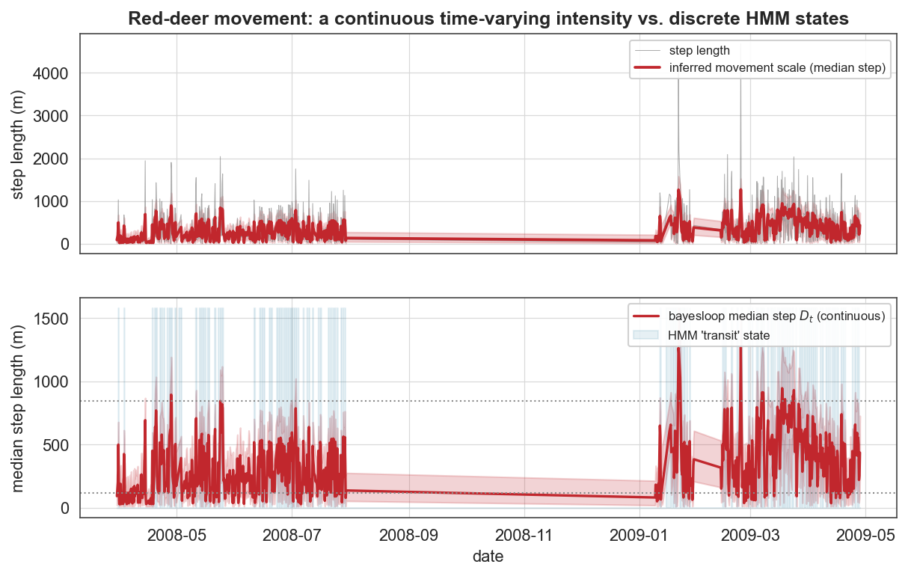

# Case study 11 — Movement ecology
## Behavioural states of a red deer: a continuous time-varying parameter vs. the fixed-state HMM

**Field:** Movement ecology · **bayesloop features:** custom `NumPy` Rayleigh observation model, `HyperStudy` (time-varying movement scale), `RegimeSwitch`, **evidence-based selection of the *kind* of dynamics** · **Established model it beats:** the Hidden Markov Model (moveHMM / momentuHMM) · **Data:** red-deer GPS track, 6-hourly fixes, 2008–2009 (`amt` R package; Signer, Fieberg & Avgar 2019).

---

### 1. The established approach, and where it strains

The standard way to read behaviour from an animal track is a **Hidden Markov Model**: every step is assigned to one of **K discrete states** (classically 2 — "encamped/foraging" vs "exploratory/transit"), each with its own step-length distribution and a state-to-state transition matrix (`moveHMM`, `momentuHMM`). HMMs are powerful but carry two well-known liabilities:

1. **K must be fixed in advance**, and choosing it is notoriously fraught (AIC/BIC often disagree, and 2-vs-3 states is a perennial argument in the literature).
2. **Behaviour is forced into hard categories** — within-state variation and gradual transitions are discarded.

bayesloop offers a different and arguably more honest description: treat the **movement scale itself as a continuous time-varying parameter**, infer it with full uncertainty, and let the **model evidence decide whether the dynamics are static, gradually drifting, or abruptly switching** — with no K to specify. This is exactly the "superstatistical heterogeneous random walk" idea bayesloop's authors introduced for migrating cells (Metzner et al., *Nat. Commun.* 2015).

### 2. Method

We take the 6-hourly step lengths Lₜ and model them as **Rayleigh-distributed** with a time-varying scale Dₜ — the exact distribution of the distance moved under 2-D isotropic Gaussian increments, and rotation-invariant, so directional persistence does not bias it. We fit three dynamics with bayesloop (Static, `GaussianRandomWalk`, `RegimeSwitch`) and compare their evidence, and we fit Gaussian HMMs with K = 1–4 (the established benchmark) on the log step lengths.

### 3. Results



The inferred movement scale (red) tracks a clear **seasonal behavioural rhythm**: high, variable movement through spring–summer 2008, a long near-dormant period in autumn–winter (the deer contracts to a small winter range), and a return to high activity in spring 2009. The HMM's "transit" state (blue shading) lights up during the active periods — the two methods agree on *where* the animal is moving — but bayesloop renders it as a **continuous intensity with credible bands** rather than a binary label.


This is the crux. The 2-state HMM (BIC's pick here) describes the deer with just two numbers — a "slow" state with median step **116 m** and a "fast" state at **846 m**. But the bayesloop posterior shows the movement scale is a **continuum**. Comparing like with like — both methods expressed as a *median step length* in metres, since the Rayleigh scale Dₜ is not itself a step length — bayesloop's inferred scale sits **between** those two discrete values for **81% of the track** and almost never pins to either extreme. And the **HMM itself cannot confidently label 33% of the fixes** (its posterior state probability stays below 0.9): a third of the time the discrete model is guessing. That intermediate behaviour is exactly what a two-state label has nowhere to put.

**The decisive, evidence-based point:** bayesloop's marginal likelihood ranks the dynamics

| Dynamics | log₁₀ evidence |
|---|---|
| Static | −2773 |
| **Gradual drift (continuous)** | **−2475** |
| Regime switch (discrete-like) | −2521 |

**Gradual continuous variation beats abrupt regime-switching by ~46 log₁₀ units.** In other words, the data themselves prefer a *continuum* over discrete state-switching — precisely the assumption the HMM hard-codes. bayesloop can pose and answer that question; the HMM cannot.

### 4. The advantage, concretely

| | HMM (moveHMM) | bayesloop |
|---|---|---|
| Number of states | must be fixed (K); selection fraught | **none — continuous parameter** |
| Output | hard state label per step | **continuous Dₜ + credible band** |
| Intermediate behaviour | forced into a bin (HMM unsure on 33% of fixes) | **represented directly** (81% sit between the two states) |
| "Discrete vs continuous?" | cannot ask | **answered by evidence (continuous wins)** |
| Free parameters | K means + K scales + K×K transitions | **1 parameter + 1 smoothness hyper-parameter** |

bayesloop recovers the same behavioural segmentation a movement ecologist would get from an HMM, but adds calibrated uncertainty, exposes the behavioural continuum the HMM discards, sidesteps the K-selection problem, and — through the evidence — shows the continuum is the better description. That is "more information **and** a simpler model."

> ⚠️ **Honest scoping.** The Rayleigh-scale model uses step length only (as basic HMMs do); it does not use turning angles / directional persistence, which `momentuHMM` can add. The two model classes are not directly likelihood-comparable, so the claim is about *information content and assumptions*, not a single fit statistic. The winter quiescence partly reflects genuine range contraction.

### 5. Reproduce

```bash
python scripts/fetch_data.py            # caches data/animal/deer_track.csv (amt package)
python scripts/cs11_animal_movement.py  # writes figures/cs11_*.png and reports/cs11_results.json
```

### 6. Sources

- Data: red-deer GPS track, `amt` R package — Signer, Fieberg & Avgar, *Animal movement tools (amt)*, **Ecology & Evolution** 9:880 (2019).
- Established model: Michelot, Langrock & Patterson, *moveHMM*, **Methods Ecol. Evol.** 7:1308 (2016); Patterson et al., *Statistical modelling of animal movement*, **AStA** (2017).
- Method: Metzner et al., *Superstatistical analysis and modelling of heterogeneous random walks*, **Nat. Commun.** 6:7516 (2015); Mark et al., **Nat. Commun.** 9:1803 (2018) — bayesloop.
