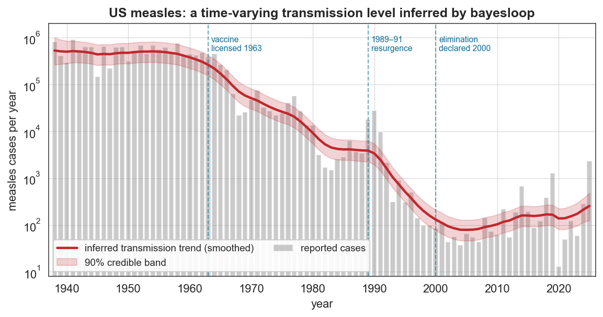
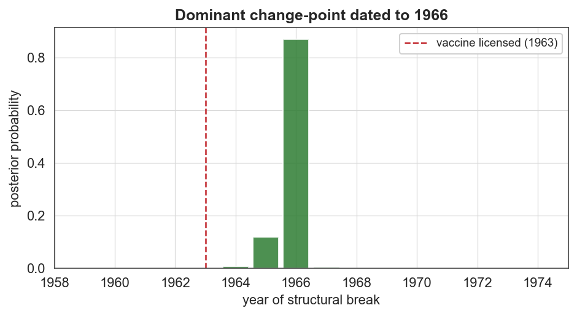
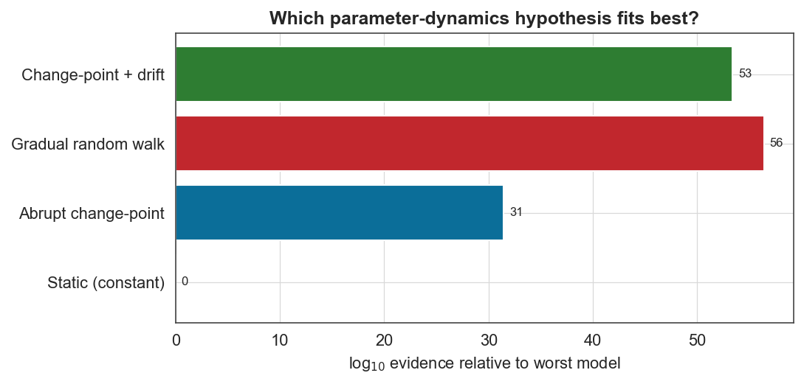
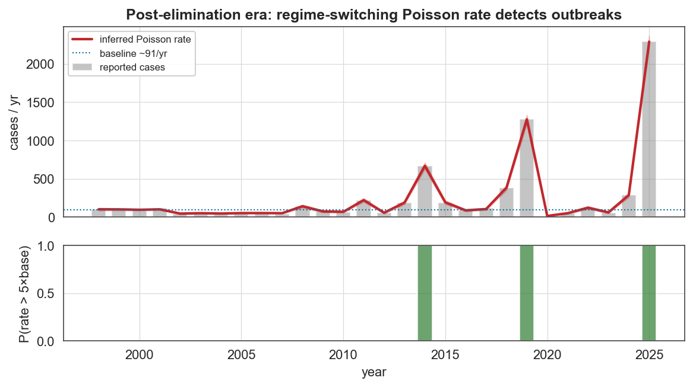

# Case study 1 — Epidemiology
## Did the measles vaccine cause an abrupt regime shift or a gradual decline? A time-varying analysis of 88 years of US incidence

**Field:** Infectious-disease epidemiology · **bayesloop features:** Gaussian observation model, `HyperStudy`, `ChangepointStudy`, Bayesian model selection by marginal evidence, custom log-stable Poisson, `RegimeSwitch` · **vs established:** before–after split / structural-break test · **Data:** US national annual measles cases 1919–2025 (Our World in Data, compiled from US CDC notifiable-disease reports / Project Tycho).

---

### 1. The question

Measles is one of the great success stories of public health. A vaccine was licensed in **1963**, and the United States declared measles **eliminated in 2000**. The textbook narrative is a clean "before/after" story. But was the vaccine's epidemiological signature really an *abrupt* break, or a *gradual* multi-year decline as coverage accumulated — and can we date the transition from the data alone, without assuming when it happened?

This is precisely the kind of question bayesloop is built for. Rather than fitting one static model, we let the transmission level vary in time and ask the data which *kind* of variation it prefers, using the marginal likelihood (model evidence) as an objective, complexity-penalised score.

### 2. Data

US national annual measles case counts. The series is contiguous from **1938 to 2025** and spans almost five orders of magnitude — from **894,134** cases (1941) to **13** (2020). Because of this enormous dynamic range we model **log₁₀(cases)** with a Gaussian observation model (standard practice for incidence data); the post-elimination era is analysed separately on the natural count scale with a Poisson model.

### 3. Method

**Observation model (full history).** `bl.om.Gaussian('mean', …, 'std', …)` on yₜ = log₁₀(casesₜ): each year's log-incidence is Gaussian with a time-varying mean (the transmission *level*) and a free standard deviation (absorbing the strong biennial epidemic cycles of the pre-vaccine era).

**Four competing hypotheses for the parameter dynamics**, all sharing the identical observation model and data so their evidences are directly comparable:

| Hypothesis | Transition model | Idea |
|---|---|---|
| Static | `tm.Static()` | level never changes (null) |
| Abrupt change-point | `tm.ChangePoint('t_change','all')` | one structural break, two constant regimes |
| Gradual random walk | `tm.GaussianRandomWalk` (HyperStudy over the step size) | level drifts smoothly year to year |
| Change-point + drift | `CombinedTransitionModel(ChangePoint, GaussianRandomWalk)` | an abrupt break superimposed on gradual drift |

The `ChangepointStudy` scans **every** possible break year and returns a full posterior over the change-point time. The `HyperStudy` marginalises the random-walk step size.

### 4. Results



The inferred trend (red — a *regularised* random walk; see the modelling note below) reproduces the whole modern history of US measles: the pre-vaccine plateau near **5 × 10⁵** cases/year, the post-1963 collapse, the **1989–91 resurgence** (resolved as a temporary bump), the drive to elimination, and the recent resurgence culminating in the 2025 spike.

**Model selection (log₁₀ evidence — higher is better):**

| Model | log₁₀ evidence | vs. static |
|---|---|---|
| Static (constant) | −78.6 | — |
| Abrupt change-point | −47.1 | 10³¹ × better |
| **Gradual random walk** | **−22.2** | **10⁵⁶ × better** |
| Change-point + drift | −25.2 | 10⁵³ × better |

The **gradual random walk wins decisively** — it is ~10²⁵ times more probable than a single abrupt change-point, and adding a change-point *on top* of the drift makes the model **worse** (the Occam penalty for the extra parameter is not repaid). The scientific reading is clear and non-trivial: the vaccine's epidemiological footprint is **not** a single clean break but a *sustained, multi-decade decline* as coverage ratcheted up through successive immunisation campaigns and the 1989–91 wake-up call that produced the two-dose schedule and the Vaccines for Children program.



When we nonetheless *force* a single change-point, the posterior places **87% of its mass on 1966** (90% credible interval 1965–1966) — three years *after* the 1963 licensing, exactly the lag expected for mass uptake. This matches the historical record almost verbatim: the CDC describes "a precipitous drop in reported measles cases from near 700,000 in 1965 to only 1,500 in 1983." The raw series gives a **pre-vaccine mean of ~533,000 cases/year** (1938–62) falling to a **1983 minimum of 1,497** — a **356-fold reduction**, squarely in line with the historical "~700,000 → ~1,500."



> **Modelling note — smoothing vs. flexibility (honest caveat).** Left to maximise evidence, the random walk picks a fairly *large* step size (σ ≈ 0.33 log₁₀/yr): it has to, in order to follow the steep 1960s decline, and a *single, global* step size cannot also be small in the flat plateaus. The side-effect is that the evidence-optimal fit **tracks year-to-year epidemic variation rather than smoothing it** in the stable eras (it is not noise-collapse — the observation-noise std stays at a healthy ≈0.19). The trend drawn above therefore uses a deliberately *regularised* step (σ = 0.10) so the line represents the secular transmission level, not the yearly wiggles. Crucially, **the model-selection conclusion is robust to this choice**: even the regularised σ = 0.10 fit scores log₁₀-evidence ≈ −29, still beating the single change-point (−47) by ~18 orders of magnitude and static (−79) by ~50 — because the win comes from the *sustained, multi-decade* nature of the decline, not from over-fitting. (A heavy-tailed `AlphaStableRandomWalk` fits even better still — evidence ≈ −19.8, tail index α ≈ 1.7 — confirming the decline is best described by occasional large jumps; it too tracks the plateaus, since the issue is global responsiveness, not the step distribution.)

**Post-elimination surveillance (1998–2025).** Here counts are small enough (13–2,288) to model directly as Poisson — but bayesloop's built-in Poisson overflows above ~170 counts, so we supply a numerically stable log-space Poisson as a one-line `bl.om.NumPy` custom model, paired with a `RegimeSwitch` transition that permits rare abrupt jumps.



The inferred rate sits on a ~**91 cases/year** "eliminated" baseline and the regime-switching model flags **2014, 2019 and 2025** as outbreaks: the posterior probability that the rate exceeds 5× baseline is **1.00** for both 2019 (1,274 cases — then the most since 1992) and 2025 (2,288 cases — the worst since elimination).

### 5. Why this is a good bayesloop showcase

- **It answers a real scientific question with model evidence**, not just curve-fitting: "abrupt vs. gradual" is settled quantitatively, and the answer (gradual) is the *less* obvious one.
- **The change-point posterior is a genuine measurement** — a dated transition (1966) with a credible interval, recovered without telling the model when the vaccine arrived.
- **It demonstrates the full toolbox** end-to-end on one dataset: Gaussian and (custom) Poisson observation models, `Static`/`ChangePoint`/`GaussianRandomWalk`/`Combined` transition models, `HyperStudy`, `ChangepointStudy`, and `RegimeSwitch`.
- **Every number cross-checks against the published epidemiological record** (1966 transition, 1983 trough, 356-fold drop, 1989–91 resurgence ≈ 55,000 cases, 2019/2025 outbreaks).

### 6. Reproduce

```bash
python scripts/fetch_data.py          # caches data/measles/owid_number_of_measles_cases.csv
python scripts/cs1_measles.py         # writes figures/cs1_*.png and reports/cs1_results.json
```

### 7. Sources

- Data: [Our World in Data — *Number of measles cases*](https://ourworldindata.org/grapher/number-of-measles-cases) (US CDC / Project Tycho).
- van Panhuis et al., *Contagious Diseases in the United States from 1888 to the present*, **NEJM** 369:2152 (2013) — Project Tycho.
- Orenstein et al., *Measles Elimination in the United States*, **J. Infect. Dis.** 189:S1 (2004).
- CDC MMWR, *Measles — United States, 1990* and the 1989–91 resurgence (>55,000 cases, 123 deaths).
- Method: Mark et al., *Bayesian model selection for complex dynamic systems*, **Nat. Commun.** 9:1803 (2018) — bayesloop.
