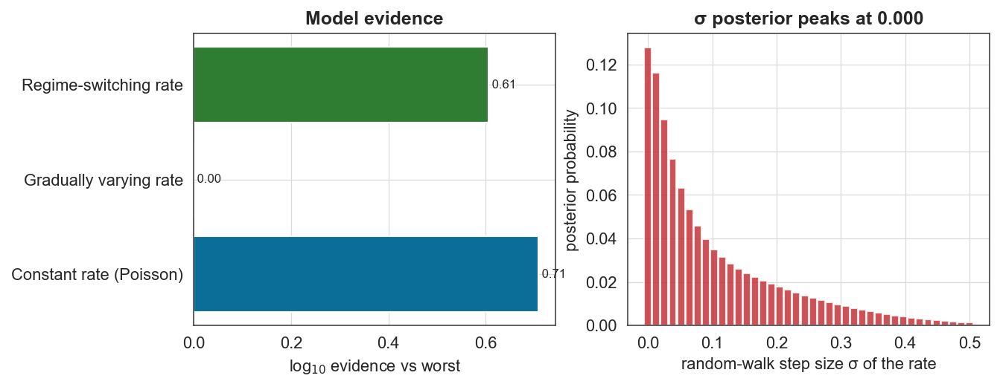
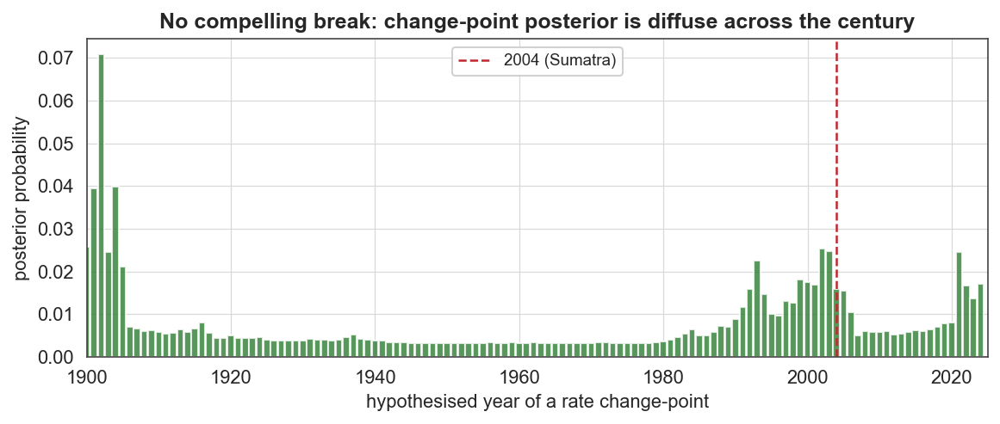

# Case study 2 — Seismology
## Has the global risk of great earthquakes really increased? A Bayesian verdict on the 2004–2011 cluster

**Field:** Seismology / geophysics · **bayesloop features:** Poisson observation model, `Study` (static), `HyperStudy` (marginalised random-walk magnitude), `RegimeSwitch`, `ChangepointStudy`, **model selection that favours the simpler model** · **vs established:** frequentist Poisson/dispersion test · **Data:** USGS ComCat global earthquake catalogue, M ≥ 7, 1900–2025 (analysed at M ≥ 8).

---

### 1. The question

Between December 2004 and March 2011 the planet produced an extraordinary run of giant earthquakes — **Sumatra–Andaman (M9.1, 2004)**, **Maule, Chile (M8.8, 2010)** and **Tōhoku, Japan (M9.1, 2011)** — three of the six largest events ever instrumentally recorded, within seven years. This naturally raised an alarming question: *is the Earth entering a more seismically active phase, or is this cluster just bad luck?* Shearer & Stark (PNAS 2012) and Michael (GRL 2011) argued statistically for "bad luck." Here we give an independent answer with bayesloop, by letting the **annual rate of great earthquakes vary freely in time** and asking whether the data actually demand any such variation.

This is the mirror image of the measles study: there the evidence overwhelmingly favoured a *changing* parameter; here the right answer is that the parameter is *constant*, and a good method must be able to say so.

### 2. Data

The USGS ComCat catalogue is essentially complete for **M ≥ 8** ("great") earthquakes back to 1900. Over 1900–2025 it contains **100 such events** — a mean of **0.79 per year**. We bin them into annual counts (0–4 per year) and model the counts directly with a Poisson observation model.

### 3. Method

The observation model is `bl.om.Poisson('rate', …)`. We compare three hypotheses about how the rate behaves over 126 years, plus a change-point scan:

| Model | Transition | Question |
|---|---|---|
| Constant rate | `tm.Static()` | homogeneous Poisson process (null) |
| Gradually varying | `tm.GaussianRandomWalk` (HyperStudy over step size σ) | does the rate drift? |
| Regime-switching | `tm.RegimeSwitch` | does the rate jump between levels? |
| Change-point scan | `ChangepointStudy` + `tm.ChangePoint` | is there a single break (e.g. around 2004)? |

Because all models share the identical Poisson observation model and data, their **log₁₀ marginal evidences are directly comparable**, and the marginalisation automatically penalises the extra flexibility of the time-varying models.

### 4. Results

**A textbook-clean Poisson signature.** The annual counts have an **index of dispersion (variance / mean) of 0.97** — a homogeneous Poisson process predicts exactly 1.0. By this classical diagnostic alone the counts are indistinguishable from constant-rate randomness.

**The evidence favours the constant rate.**

| Model | log₁₀ evidence |
|---|---|
| **Constant rate (Poisson)** | **−65.09** |
| Regime-switching rate | −65.20 |
| Gradually varying rate | −65.80 |

The constant-rate model wins. The flexible random-walk model is ~10⁰·⁷ ≈ **5× less probable**, paying an Occam penalty for freedom it doesn't need.


The picture makes the verdict visual: even the *most* flexible inferred rate (red) never escapes the orbit of the long-term mean (dashed). During the 2004–2011 window the posterior-mean rate edges up only to **1.03/yr** (vs 0.79 long-term) and its 90% credible band still comfortably contains the mean. Crucially, the figure also reveals that the **1952–1965 burst of M ≥ 8.5 giants (7 events) was actually *larger* than the 2004–2012 burst (5 events)** — 1952 Kamchatka (M9.0), 1957 Aleutian (M8.6), **1960 Chile (M9.5, the largest ever recorded)**, 1964 Alaska (M9.2), 1965 Rat Islands (M8.7). A "recent increase" narrative has to explain away an *earlier* cluster that was bigger.



The decisive panel is on the right: the posterior for the random-walk step size σ — the magnitude of year-to-year rate change — **peaks at exactly 0 and decays monotonically**. The data prefer *no* temporal variation at all. This is the strongest Bayesian statement of constancy one can make. And it is **not an artefact of the prior**: swapping the default Jeffreys prior on the rate for a flat prior leaves the constant model ahead by essentially the same margin (+0.79 vs +0.71 log₁₀).



Finally, when we force a single change-point anywhere in the century, the posterior is **diffuse** — its modal year carries only 7% probability and there is no concentration near 2004. There is simply no break to find.

### 5. The scientific conclusion

bayesloop independently reproduces the headline of Shearer & Stark (2012): **the global rate of great earthquakes shows no statistically significant increase.** The 2004–2011 cluster of giant earthquakes — and the comparably-sized 1952–1965 cluster before it — are exactly what a constant ~0.8/year Poisson process produces from time to time. The apparent "acceleration" is a cognitive artefact of clustering in a random process, not a change in tectonic rate.

### 6. Why this is a good bayesloop showcase

- **It demonstrates that the framework will choose simplicity when warranted.** A method that can only ever "find" time variation is dangerous; bayesloop's marginal-likelihood model selection returns a principled null result, with the σ posterior pinned at zero.
- **It quantifies a public-facing scientific controversy** with a transparent, reproducible Bayesian calculation rather than a frequentist p-value.
- **It pairs naturally with Case study 1**: same Poisson machinery, opposite conclusion — a clean illustration that the evidence, not the modeller, decides.

> ⚠️ **Caveat (honest scoping).** Completeness is excellent for M ≥ 8 from 1900; the same is *not* true for M ≥ 7, where the apparent rise in recent decades is largely a detection/catalogue artefact (denser seismometer networks). We deliberately analyse M ≥ 8 to avoid that confound.

### 7. Reproduce

```bash
python scripts/fetch_data.py          # caches data/earthquakes/usgs_m7_global.csv (USGS FDSN API)
python scripts/cs2_earthquakes.py     # writes figures/cs2_*.png and reports/cs2_results.json
```

### 8. Sources

- Data: [USGS ComCat / FDSN event service](https://earthquake.usgs.gov/fdsnws/event/1/).
- Shearer & Stark, *Global risk of big earthquakes has not recently increased*, **PNAS** 109:717 (2012).
- Michael, *Random variability explains apparent global clustering of large earthquakes*, **Geophys. Res. Lett.** 38:L21301 (2011).
- Ammon, Lay & Simpson, *Great earthquakes and global seismic networks*, **Seismol. Res. Lett.** 81:965 (2010).
- Method: Mark et al., *Bayesian model selection for complex dynamic systems*, **Nat. Commun.** 9:1803 (2018) — bayesloop.
