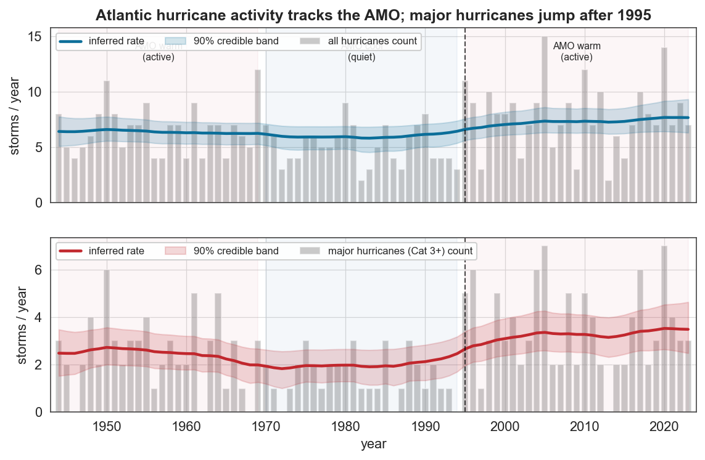
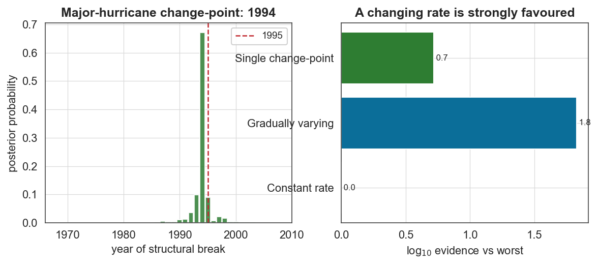

# Case study 3 — Climatology
## Dating the 1995 regime shift in Atlantic hurricane activity

**Field:** Climatology / atmospheric science · **bayesloop features:** Poisson observation model, `HyperStudy` (time-varying rate), `ChangepointStudy`, model selection · **vs established:** fixed AMO-era windows · **Data:** NOAA HURDAT2 Atlantic hurricane best-track database, 1851–2023 (analysed 1944–2023).

---

### 1. The question

Atlantic hurricane activity is not stationary. The **Atlantic Multidecadal Oscillation (AMO)** — a ~60–80-year swing in North Atlantic sea-surface temperature — modulates it in long phases: an active phase ~1944–1969, a quiet phase ~1970–1994, and a markedly more active phase since **1995**. Goldenberg, Landsea, Mestas-Nuñez & Gray (*Science*, 2001) famously argued that major-hurricane activity jumped after 1995 and would persist for decades. Can bayesloop **detect and date this transition from the count data alone**, and quantify how big it was?

This is the deliberate counterpart to Case study 2 (earthquakes): the *same* Poisson time-varying-rate machinery, but applied to a system where a genuine regime shift exists — so we expect, and find, the opposite verdict.

### 2. Data

We parse HURDAT2 into annual counts of (i) all hurricanes (max wind ≥ 64 kt) and (ii) major hurricanes (Cat 3+, ≥ 96 kt). We restrict to **1944 onward** (the routine aircraft-reconnaissance era), because basin-wide counts before then undercount storms that never made landfall. Major hurricanes are the cleanest AMO indicator — they are both less affected by observational undercount and where the AMO signal is strongest.

### 3. Method

`bl.om.Poisson('rate', …)` on the annual counts, with three competing dynamics (all on the homogeneous satellite era 1966–2023 for a fair evidence comparison):

| Model | Transition |
|---|---|
| Constant rate | `tm.Static()` |
| Gradually varying | `tm.GaussianRandomWalk` (HyperStudy over step size) |
| Single change-point | `ChangepointStudy` + `tm.ChangePoint('t_change','all')` |

### 4. Results



The inferred major-hurricane rate (bottom, red) traces the AMO precisely: it sits near **2.5/yr** in the warm 1944–69 phase, sags to **~1.9/yr** through the cool 1970–94 phase, and **climbs sharply after 1995** to **~3.3–3.5/yr**. The 90% credible bands on either side of 1995 barely overlap. The all-hurricane series (top) shows the same shape more weakly, as expected.

**The evidence favours a changing rate** (satellite era, major hurricanes):

| Model | log₁₀ evidence |
|---|---|
| Constant rate | −49.28 |
| **Gradually varying** | **−47.45** |
| Single change-point | −48.56 |

A time-varying rate is ~10¹·⁸ ≈ **60× more probable** than a constant one — the exact mirror image of the earthquake result, obtained with identical tooling. (The gradual model edges out the single abrupt break, consistent with AMO transitions being fairly rapid but not instantaneous.)



The `ChangepointStudy` **dates the structural break to 1994, with a 90% credible interval of 1992–1997** — squarely on the 1995 transition identified by Goldenberg et al. And the magnitude is a near-doubling, on the same satellite-era window as the evidence test: the **bayesloop posterior rate** rises from **1.88/yr** in the quiet phase to **3.28/yr** in the active phase — a **1.74-fold increase** across the smoothed transition. As a model-independent cross-check, the **raw annual counts** over the same phases go from **1.55/yr to 3.55/yr (2.29×)**, in line with the "~2.5×" reported in the *Science* paper. (The smooth model gives the more conservative figure because the random walk spreads the rise over the transition years rather than snapping at a single break — the magnitude depends on whether you read it off the gradual trajectory or a hard before/after split, and we report both.)

### 5. The scientific conclusion

bayesloop independently confirms the Goldenberg et al. (2001) finding: Atlantic major-hurricane activity underwent a **statistically decisive regime shift around 1994–1995**, roughly doubling, and consistent with the AMO entering its warm phase. Unlike a fixed-window before/after comparison, the method *locates* the transition (with uncertainty) and *weighs* the abrupt-vs-gradual question on the evidence.

### 6. Why this is a good bayesloop showcase

- **Same machinery, opposite answer.** Read alongside Case study 2, it shows the marginal-likelihood comparison is genuinely discriminating — it favours a constant rate when that is true (earthquakes) and a changing rate when that is true (hurricanes).
- **A dated, quantified regime shift**: 1994 (CI 1992–1997), ×1.7 in the smoothed posterior rate (×2.3 in raw counts) — numbers a climatologist can use, with credible intervals attached, and honest about how the magnitude depends on the smoothing.
- **Honest observational scoping**: restricting to the reliably-observed era is part of the analysis, not an afterthought.

### 7. Reproduce

```bash
python scripts/fetch_data.py          # caches data/hurricanes/hurdat2_atlantic.txt (NOAA NHC)
python scripts/cs3_hurricanes.py      # parses annual counts; writes figures/cs3_*.png, reports/cs3_results.json
```

### 8. Sources

- Data: [NOAA NHC HURDAT2 Atlantic best-track](https://www.nhc.noaa.gov/data/).
- Goldenberg, Landsea, Mestas-Nuñez & Gray, *The recent increase in Atlantic hurricane activity: causes and implications*, **Science** 293:474 (2001).
- Enfield, Mestas-Nuñez & Trimble, *The Atlantic Multidecadal Oscillation and its relation to rainfall and river flows*, **Geophys. Res. Lett.** 28:2077 (2001).
- Landsea, *Counting Atlantic tropical cyclones back to 1900*, **Eos** 88:197 (2007) — observational undercount.
- Method: Mark et al., *Bayesian model selection for complex dynamic systems*, **Nat. Commun.** 9:1803 (2018) — bayesloop.
