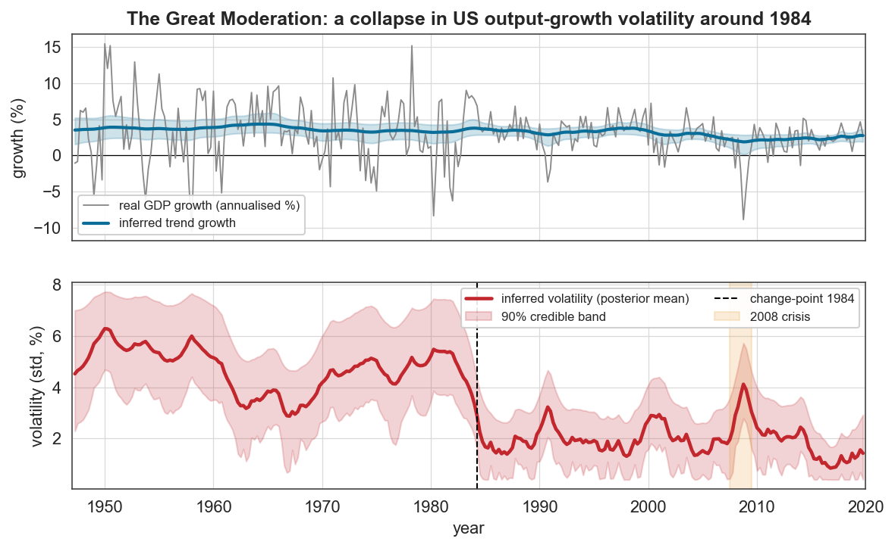
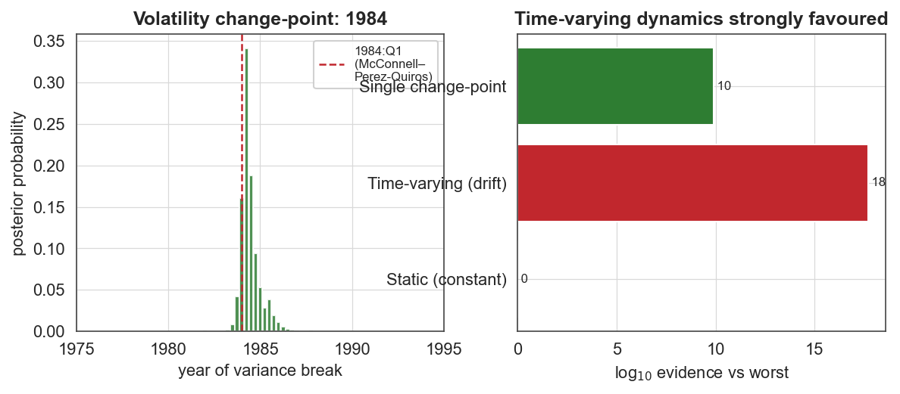
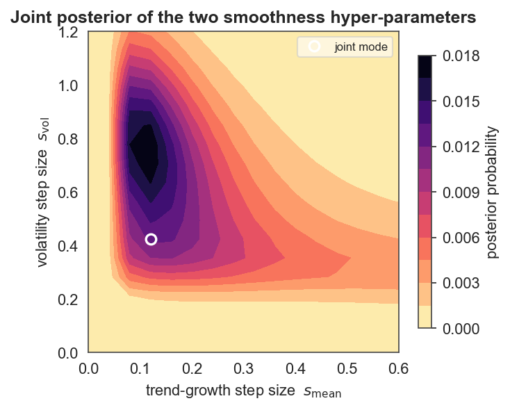

# Case study 4 — Macroeconomics
## The Great Moderation: dating the collapse in US output-growth volatility

**Field:** Macroeconomics / econometrics · **bayesloop features:** Gaussian observation model with **two simultaneously time-varying parameters** (mean *and* volatility), `CombinedTransitionModel`, 2-D `HyperStudy` with `get_joint_hyper_parameter_distribution`, `ChangepointStudy`, parallel `fit(n_jobs=…)` · **vs established:** Chow / Bai-Perron / Markov-switching · **Data:** FRED real GDP (GDPC1), quarterly, 1947–2019.

---

### 1. The question

One of the most studied facts in modern macroeconomics is the **Great Moderation**: starting in the mid-1980s, the volatility of US real-GDP growth fell sharply and stayed low for two decades. Kim & Nelson (1999) and McConnell & Perez-Quiros (2000) pinned the variance break to **1984:Q1**; Stock & Watson (2002) catalogued the breadth of the decline. Can bayesloop recover this purely from the growth series — *date* the break, *quantify* the drop, and show the volatility rising again in 2008?

### 2. Data

Quarterly real GDP (chained 2017 dollars). We compute annualised log-growth gₜ = 400·Δlog(GDPₜ). The 2020 COVID quarters are off the chart (−33% then +30% annualised) and would dominate any Gaussian volatility scale, so the main analysis runs **1947Q2–2019Q4** and COVID is discussed separately.

### 3. Method

We model growth as Gaussian with **both** a time-varying mean (trend growth) and a time-varying standard deviation (volatility):

```text
L = bl.om.Gaussian('mean', …, 'vol', …)
T = bl.tm.CombinedTransitionModel(
        bl.tm.GaussianRandomWalk('s_mean', …, target='mean'),
        bl.tm.GaussianRandomWalk('s_vol',  …, target='vol'))
S = bl.HyperStudy(); S.set(L, T); S.fit(n_jobs=4)
```

The `HyperStudy` marginalises over **both** random-walk step sizes simultaneously — a genuinely 2-D hyper-parameter inference. A separate `ChangepointStudy` scans every quarter for the single dominant structural break, and we compare the evidence of static, gradually-varying, and single-change-point models.

### 4. Results



The bottom panel *is* the Great Moderation: inferred volatility sits at **~5–6%** through 1947–1983, **collapses around 1984** to **~2%**, spikes visibly during the **2008 financial crisis** (amber), and returns to a low level afterward. The top panel shows trend growth drifting gently down from ~4% to ~2½% over the same period — the slower "secular" story, cleanly separated from the volatility story by the two independent random walks.

**The change-point is dated to 1984.2, with a 90% credible interval of 1983.8–1985.5** — i.e. **1984:Q1–Q2**, essentially the exact break McConnell & Perez-Quiros (2000) identified by classical methods.



**Magnitude.** Empirically, growth volatility fell from **4.69% (1947–1983)** to **2.03% (1984–2007)** — a **2.3-fold** reduction. The smooth bayesloop estimate is even sharper across the break: **~5.2% (1980) → ~1.9% (1995)**.

**Model evidence (log₁₀):**

| Model | log₁₀ evidence |
|---|---|
| Static (constant) | −348.1 |
| **Time-varying (drift)** | **−330.4** |
| Single change-point | −338.2 |

The time-varying model is favoured over static by **~18 log₁₀ units (10¹⁸×)**. Interestingly, the gradual-drift model also beats the single-change-point model: the data are best described as a *low-volatility regime established in 1984* but with further evolution (the 2008 spike, the even-quieter 2010s) that a single break cannot capture.

### 5. The scientific conclusion

bayesloop reproduces the canonical Great Moderation result — a variance break at **1984:Q1**, a **~2.3× drop in growth volatility** — and adds value a fixed before/after split cannot: a *credible interval* on the break date, a *continuous* volatility trajectory that exposes the 2008 spike and the post-crisis return to calm, and an evidence-based statement that the moderation is a regime *plus* ongoing evolution, not a single clean step.

### 6. Why this is a good bayesloop showcase

- **Two time-varying parameters at once.** Trend growth and volatility are disentangled by a `CombinedTransitionModel` and a 2-D `HyperStudy` — exactly the "models whose parameters have dynamics of their own" use case bayesloop was built for. The **joint posterior over the two random-walk step sizes** (below) shows both are well-identified with interior modes (s_mean ≈ 0.12, s_vol ≈ 0.42) and essentially independent — the trend-smoothness and volatility-smoothness are separately learned from the data, not assumed.


- **It re-derives a textbook econometric result** (1984:Q1 break) with a transparent grid-Bayesian method and attaches uncertainty to the date.
- **Distinct from the author's CAPM work**: this is macro-volatility regime detection on output growth, not asset pricing.
- **Honest treatment of outliers**: the COVID shock is excluded with a stated reason rather than silently distorting the volatility scale.

### 7. Reproduce

```bash
python scripts/fetch_data.py              # caches data/gdp/fred_gdpc1.csv (FRED)
python scripts/cs4_great_moderation.py    # writes figures/cs4_*.png and reports/cs4_results.json
```

### 8. Sources

- Data: [FRED — Real Gross Domestic Product (GDPC1)](https://fred.stlouisfed.org/series/GDPC1), US BEA.
- Kim & Nelson, *Has the U.S. economy become more stable?*, **Rev. Econ. Stat.** 81:608 (1999).
- McConnell & Perez-Quiros, *Output fluctuations in the United States: what has changed since the early 1980s?*, **Amer. Econ. Rev.** 90:1464 (2000).
- Stock & Watson, *Has the business cycle changed and why?*, **NBER Macroeconomics Annual** 17:159 (2002).
- Method: Mark et al., *Bayesian model selection for complex dynamic systems*, **Nat. Commun.** 9:1803 (2018) — bayesloop.
