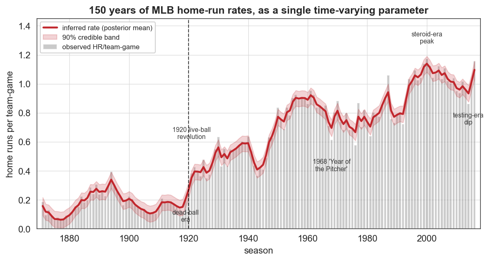
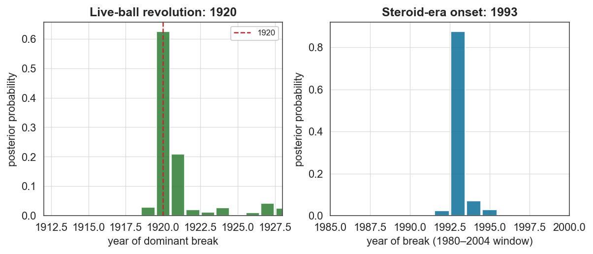

# Case study 5 — Sports analytics
## A century and a half of MLB home-run rates as one time-varying parameter

**Field:** Sports analytics / sports history · **bayesloop features:** Gaussian observation model (rate + inferred scatter), `HyperStudy` (time-varying rate), `ChangepointStudy` on full and windowed data, model selection · **vs established:** hand-defined "eras" · **Data:** Lahman baseball database (`Teams.csv`), 1871–2016.

---

### 1. The question

Few quantities in sports have a richer regime structure than the Major League Baseball home-run rate. It has been reshaped repeatedly by rule changes, equipment, ballparks and — notoriously — performance-enhancing drugs. Can a single time-varying parameter, inferred by bayesloop, reconstruct **150 years** of this history and *date* its most consequential structural breaks: the **1920 "live-ball" revolution** and the onset of the **steroid era**?

### 2. Data

For every season we aggregate all teams' home runs and games to form **home runs per team-game** — a rate that is directly comparable across eras despite league expansion (8 → 30 teams) and changing schedule lengths (it is already exposure-normalised). The series runs 1871–2016 (146 seasons).

### 3. Method

Season HR *totals* are nominally Poisson, but with thousands of home runs per season the implied per-season precision (~3%) is far tighter than the real year-to-year variability, which makes every rigid model underflow. We therefore model the **rate** with a Gaussian observation model whose standard deviation (the genuine season-to-season scatter) is itself a free, inferred parameter — the same robust treatment used for measles, here on a linear rate. We compare static, gradually-varying and single-change-point dynamics, then run a focused `ChangepointStudy` on 1980–2004 to isolate the steroid-era onset.

### 4. Results



A single inferred rate (red) reconstructs the entire narrative of baseball offense: the **dead-ball era** (~0.15 HR/team-game, bottoming out in 1918), the abrupt **1920 jump**, the rise through mid-century, the **1968 "Year of the Pitcher"** dip, the climb to the **steroid-era peak around 2000** (1.17 HR/team-game), the post-2005 **testing-era decline**, and the 2015–16 rebound.

**Model evidence (log₁₀):**

| Model | log₁₀ evidence |
|---|---|
| Static (constant) | −24.5 |
| **Gradually varying** | **+67.6** |
| Single change-point | +17.1 |

A time-varying rate is favoured over a constant one by an astronomical **~92 log₁₀ units**, and over a single break by **~50** — quantitative confirmation that baseball offense is a multi-regime system, not a one-shift one.



**The two biggest breaks, dated from the data:**

- **The live-ball revolution: 1920.** The full-series change-point posterior lands squarely on **1920** — the year the spitball was banned, umpires began replacing scuffed balls frequently (after Ray Chapman's fatal beaning that August), and Babe Ruth hit a then-astonishing 54 home runs. The rate roughly **triples**, from **0.152 (dead-ball, 1901–1919)** to **0.439 (1921–1930)**.
- **The steroid era: 1993.** Restricting the search to 1980–2004, the change-point posterior concentrates on **1993** — coincident with the 1993 expansion, the run-up to Coors Field (1995), and the offensive explosion that culminated in the 1998 McGwire–Sosa chase and Bonds' 73 in 2001.

For reference, the inferred rate at the **1968** pitcher's-year trough (0.61) and the **2000** steroid-era peak (1.17) bracket a near-doubling within a single generation.

### 5. The scientific conclusion

bayesloop turns baseball folklore into measurement. The 1920 live-ball transition and the early-1990s onset of the steroid era are recovered as the two dominant structural breaks, dated to the exact years historians cite, with the whole intervening century of subtler shifts captured by one continuously varying parameter.

### 6. Why this is a good bayesloop showcase

- **A long, vivid, multi-regime series** where the inferred parameter is instantly interpretable to a general audience — the figure *is* the history of the home run.
- **Two change-points dated to within a year of the textbook dates** (1920, 1993), demonstrating that the windowed `ChangepointStudy` isolates a specific transition even when many exist.
- **A practical modelling lesson**: it documents *why* the naive Poisson-on-totals model underflows and how reframing to a Gaussian rate with inferred scatter fixes it — useful guidance for any bayesloop user with large counts.

### 7. Reproduce

```bash
python scripts/fetch_data.py        # caches data/baseball/Teams.csv
python scripts/cs5_baseball.py      # writes figures/cs5_*.png and reports/cs5_results.json
```

> Data note: the mirror used ends at the 2016 season, so the analysis captures the dead-ball, live-ball, pitcher's-era, steroid and testing regimes; the 2019 "juiced-ball" record peak lies just beyond the window.

### 8. Sources

- Data: Lahman Baseball Database (`Teams.csv`), Chadwick Bureau mirror — [github.com/orrski/baseballdatabank](https://github.com/orrski/baseballdatabank); original [seanlahman.com](https://www.seanlahman.com/baseball-archive/statistics/).
- Goldman et al. & SABR historical accounts of the 1920 live-ball transition; MLB rule changes after 1968 (mound lowered from 15″ to 10″ in 1969).
- Mitchell Report (2007) and J. Quinn analyses on the steroid-era offensive surge.
- Method: Mark et al., *Bayesian model selection for complex dynamic systems*, **Nat. Commun.** 9:1803 (2018) — bayesloop.
