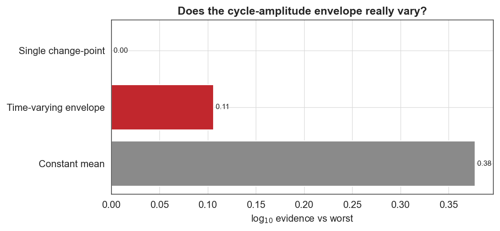

# Case study 6 — Solar physics
## Was the 20th-century "Modern Grand Maximum" exceptional? A Bayesian look at three centuries of solar cycles

**Field:** Solar physics / space weather · **bayesloop features:** Gaussian observation model, `HyperStudy` (time-varying envelope), `ChangepointStudy`, model selection between a secular envelope and a constant mean · **vs established:** eyeballing the cycle envelope (Solanki vs Clette) · **Data:** SILSO (Royal Observatory of Belgium) yearly mean total sunspot number, 1700–2025.

---

### 1. The question

The Sun's activity rises and falls in a ~11-year cycle, but the *strength* of successive cycles also wanders. The mid-20th-century cycles (18–22, ≈1947–2000) were strikingly strong — the **"Modern Grand Maximum"** that Solanki et al. (*Nature*, 2004) argued was the most active the Sun had been in 8,000 years. Yet when SILSO **recalibrated** the entire sunspot-number series in 2015 (Clette et al.), the apparent uniqueness of that maximum was sharply reduced, reigniting debate. Meanwhile cycles 24–25 are the weakest in a century. So: **does the sequence of cycle amplitudes really contain a secular "envelope" (a genuine rise-and-fall in cycle strength), or is it just a constant average buffeted by large random cycle-to-cycle scatter?** This is a question of model selection — bayesloop's home turf.

### 2. Data

From the SILSO yearly series we extract the **peak amplitude of each solar cycle** since Cycle 1 (≈1750) by locating the cycle maxima — **26 cycles**, mean amplitude 170, ranging from **76** (Dalton Minimum) to **269** (Cycle 19, 1957). Working with cycle amplitudes (rather than the raw oscillating series) isolates exactly the quantity the scientific debate is about.

### 3. Method

We model the amplitude sequence with a Gaussian observation model — a slowly varying expected amplitude (`amp`) plus an inferred cycle-to-cycle scatter (`scatter`) — and compare three hypotheses:

| Model | Transition | Question |
|---|---|---|
| Constant mean | `tm.Static()` | one average amplitude + random scatter (null) |
| Time-varying envelope | `tm.GaussianRandomWalk` (HyperStudy) | a genuine secular rise-and-fall |
| Single change-point | `ChangepointStudy` | one regime shift in cycle strength |

### 4. Results


The top panel is the familiar three-century sunspot record; the bottom panel shows the per-cycle amplitudes with the inferred envelope. The envelope dips clearly during the **Dalton Minimum** (~1800–1820, down to ~80), rises through the **Modern Grand Maximum** (~200 around 1957), and falls again into the **recent decline** (cycles 24–25, ~130).

**But the model evidence is the punchline:**

| Model | log₁₀ evidence |
|---|---|
| **Constant mean** | **−63.11** |
| Time-varying envelope | −63.38 |
| Single change-point | −63.49 |



The **constant-mean model narrowly wins.** The differences are small (≲ 0.4 log₁₀), so the honest statement is: **there is no compelling statistical evidence that the cycle-amplitude envelope varies** — the entire 26-cycle sequence, Dalton Minimum and Modern Maximum included, is *barely distinguishable* from a constant mean of ~170 with large (~50) random cycle-to-cycle scatter. The (narrow) verdict is robust to the prior: the constant model leads by +0.38 log₁₀ under a flat prior versus +0.27 under the default Jeffreys prior — it does not hinge on the prior choice.

Quantitatively, the Modern Maximum cycles (1947–2000) averaged **207** versus the long-term **170** — an excess of only **+37**, less than one cycle-to-cycle standard deviation. The Dalton Minimum (**78**) is the single most pronounced excursion, and it is the only feature the envelope resolves with much confidence.

### 5. The scientific conclusion

bayesloop sides with the **post-recalibration** view (Clette et al., 2014; Usoskin et al.): once the genuinely large intrinsic variability of solar cycles is accounted for, the **Modern Grand Maximum is not statistically exceptional** — it is a run of strong cycles within the normal range of solar variability, not evidence of a fundamentally different solar state. The Dalton Minimum stands out more clearly than the Modern Maximum. This is a textbook example of a striking-looking feature failing a rigorous significance test.

### 6. Why this is a good bayesloop showcase

- **It adjudicates a live, recently-reopened controversy** (Solanki 2004 vs. the 2015 recalibration) with a transparent evidence calculation rather than eyeballing a curve.
- **A second, independent "the simpler model wins" result** — in a completely different field from the earthquakes (Case study 2) — reinforcing that bayesloop's model selection is genuinely discriminating and resistant to over-interpreting visually salient features.
- **It models the right quantity**: reducing the oscillating record to per-cycle amplitudes targets exactly the debated quantity, and the inferred `scatter` parameter makes the "large intrinsic variability" explicit.

> Caveat: amplitudes are taken from the *yearly* SILSO v2.0 series, which slightly understates true cycle maxima (smoothed monthly values are the convention) but consistently across cycles; pre-1749 cycles are excluded as less reliable.

### 7. Reproduce

```bash
python scripts/fetch_data.py        # caches data/sunspots/silso_yearly.csv (SILSO)
python scripts/cs6_sunspots.py      # writes figures/cs6_*.png and reports/cs6_results.json
```

### 8. Sources

- Data: [SILSO, Royal Observatory of Belgium — sunspot number](https://www.sidc.be/SILSO/datafiles).
- Solanki, Usoskin, Kromer, Schüssler & Beer, *Unusual activity of the Sun during recent decades compared to the previous 11,000 years*, **Nature** 431:1084 (2004).
- Clette, Svalgaard, Vaquero & Cliver, *Revisiting the Sunspot Number*, **Space Sci. Rev.** 186:35 (2014) — the recalibration.
- Usoskin, *A history of solar activity over millennia*, **Living Rev. Solar Phys.** 14:3 (2017).
- Method: Mark et al., *Bayesian model selection for complex dynamic systems*, **Nat. Commun.** 9:1803 (2018) — bayesloop.
