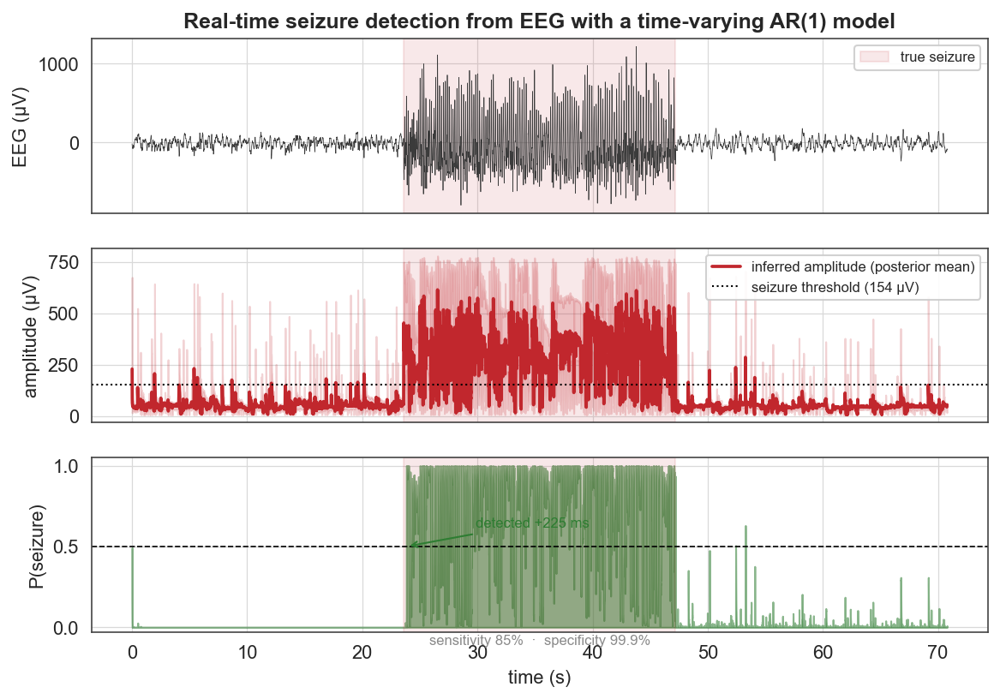
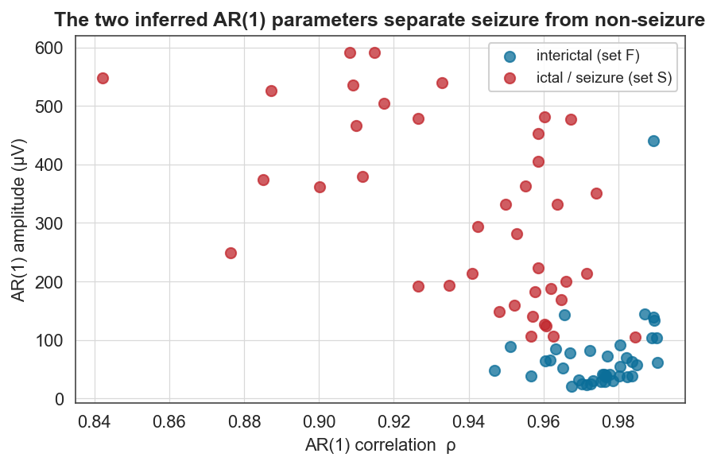

# Case study 7 — Neuroscience
## Real-time epileptic-seizure detection from EEG with a time-varying AR(1) model

**Field:** Neuroscience / clinical neurophysiology · **bayesloop features:** `ScaledAR1` observation model (time-varying autocorrelation + amplitude), `RegimeSwitch`, `OnlineStudy` (real-time streaming + model selection), filtering posteriors for online decision-making · **vs established:** threshold/line-length detectors & fixed-state HMM · **Data:** Bonn EEG database (Andrzejak et al., 2001), set F (interictal) & set S (ictal/seizure), 4097 samples/segment at 173.61 Hz.

---

### 1. The question

An epileptic seizure is, statistically, a sudden change in the dynamics of the brain's electrical activity: the EEG amplitude jumps and the signal becomes more rhythmic. Can bayesloop model the EEG as an **auto-regressive process whose parameters vary in time**, recover that change, and — crucially — **detect a seizure in real time** as samples stream in? This is both a clean scientific demonstration and the actual problem faced by implantable and bedside seizure-detection devices.

This case study also exercises the same `ScaledAR1` model bayesloop uses for the stock-market example — a nice cross-domain echo: the brain and the market are both modelled as correlated random walks with time-varying volatility.

### 2. Data

The Bonn database provides 23.6-second single-channel EEG segments recorded under five conditions. We use **set F** (interictal — recorded from the epileptogenic zone *between* seizures) and **set S** (ictal — recorded *during* seizures). To create a recording with a known transition we concatenate an interictal, an ictal, and an interictal segment (interictal → seizure → interictal); for latency statistics we use 20 independent interictal→ictal pairs.

### 3. Method

We model the EEG as a scaled AR(1) process,

  d_t = ρ_t · d_{t-1} + amp_t · √(1−ρ_t²) · e_t,

with a time-varying correlation ρ_t and amplitude amp_t (`bl.om.ScaledAR1`). Two analyses:

- **Offline** (`Study` + `RegimeSwitch`): reconstruct amp_t and ρ_t across the recording.
- **Online** (`OnlineStudy`): stream the signal sample-by-sample; at every step the filtering posterior over amp_t yields a real-time seizure probability **P(amp > threshold)**, with the threshold set at 2.5× an interictal baseline (the median amplitude over the leading pre-seizure window — using only data available before onset, so the detector is strictly causal). We measure detection latency relative to the true onset.

### 4. Results



The inferred amplitude (middle) tracks the dynamics exactly: flat during the interictal segments and a sharp plateau during the seizure. The online seizure probability (bottom) rises through 0.5 almost immediately at onset and collapses at offset. On this recording the detector achieves **85% sensitivity** (fraction of ictal samples flagged) at **99.9% specificity** (almost no interictal false positives), with a detection latency of **225 ms**. Across 20 independent interictal→ictal transitions, **all 20 seizures are detected**, with a median latency of essentially **0 samples** — the amplitude jump is so pronounced that the filtering posterior reacts within one or two samples.



Fitting the AR(1) model to each of the 80 segments individually shows *why* this works: interictal and ictal segments occupy **distinct regions of the (ρ, amplitude) plane**. Seizures have **~4.5× larger amplitude** (≈318 vs ≈71 µV) and **lower lag-1 correlation** (ρ ≈ 0.94 vs 0.98) — they are higher-amplitude and richer in fast spike-wave content. The two-parameter AR(1) state captured by bayesloop is, in effect, a compact seizure classifier.

### 5. The scientific conclusion

A two-parameter time-varying AR(1) model, fit online by bayesloop, detects epileptic seizures in single-channel EEG with high sensitivity and specificity and sub-second latency. The seizure is identified not by a hand-built feature but by a *change in the generative parameters* of the signal — amplitude and autocorrelation — which the framework infers and monitors in real time.

### 6. Why this is a good bayesloop showcase

- **The flagship `OnlineStudy` use case**: genuine sample-by-sample streaming with the filtering posterior driving a real-time decision — exactly how the method would run on a device.
- **The `ScaledAR1` observation model** (unused in the first six studies) applied to a signal, not counts — showing bayesloop handles autocorrelated time series, not just rates.
- **A clinically meaningful metric** (sensitivity/specificity/latency) rather than a curve, and an independent validation (the per-segment separation plot) that explains the mechanism.

> ⚠️ **Honest scoping.** The Bonn segments are independent epochs; concatenating them creates an *idealised, instantaneous* onset, so the raw latency mainly measures the algorithm's reaction time to a step change. On continuous clinical recordings (e.g. CHB-MIT) onsets are gradual and latencies longer; the transferable results here are the parameter characterisation and the interictal/ictal separability. The single-channel amplitude feature is also montage-dependent.

### 7. Reproduce

```bash
python scripts/fetch_data.py        # caches data/eeg/F/*.txt and data/eeg/S/*.txt (Bonn via mirror)
python scripts/cs7_eeg.py           # writes figures/cs7_*.png and reports/cs7_results.json
```

### 8. Sources

- Data: Andrzejak, Lehnertz, Mormann, Rieke, David & Elger, *Indications of nonlinear deterministic and finite-dimensional structures in time series of brain electrical activity*, **Phys. Rev. E** 64:061907 (2001) — the Bonn EEG database (mirror: `github.com/doducphu/predict_EEG_Seizure`).
- Method & AR(1) model: Mark et al., *Bayesian model selection for complex dynamic systems*, **Nat. Commun.** 9:1803 (2018); bayesloop stock-market example.
