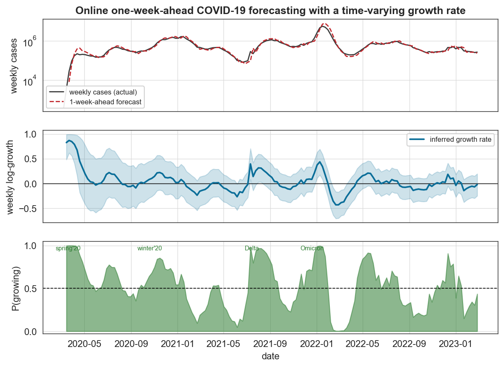
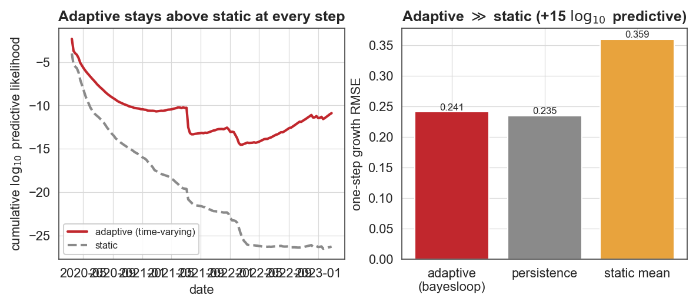

# Case study 8 — Online prediction (epidemiology)
## Forecasting COVID-19 one week ahead, and detecting every wave as it begins

**Field:** Epidemiology / forecasting · **bayesloop features:** `OnlineStudy` (sample-by-sample streaming), Gaussian observation model, `GaussianRandomWalk` vs `Static` transition models, **prequential predictive log-likelihood** (the accumulated online evidence), real-time probability queries · **vs established:** fixed-window growth-rate / EpiEstim-style Rt · **Data:** Our World in Data US daily cases → weekly sums, Mar 2020 – Feb 2023.

---

### 1. The question

The defining parameter of an unfolding epidemic is its **growth rate** g_t — the weekly change in log-cases, essentially a proxy for whether the effective reproduction number is above or below 1. It is the textbook *time-varying parameter*. Running bayesloop in true online mode, can we (a) **forecast** next week's cases as data arrive, (b) show that *adapting* the growth rate beats assuming it is constant, and (c) raise a real-time flag the moment a new wave starts?

A nice property of bayesloop here: because the `OnlineStudy` is forward-only, the model evidence it accumulates **is** the one-step-ahead predictive log-likelihood summed over the whole stream — a *prequential* score that is out-of-sample by construction, with no train/test split to argue about.

### 2. Method

We model the weekly log-growth gₜ with a Gaussian observation model whose mean is the time-varying growth rate and whose standard deviation captures week-to-week noise. We stream all 155 weeks through two `OnlineStudy` instances that share the observation model but differ in their transition model:

- **adaptive** — `GaussianRandomWalk` on the growth rate (it can drift);
- **static** — `Static` (one constant growth rate).

At each step we record the filtered growth rate, the one-step-ahead case forecast (cases_t · exp(growth)), the real-time probability **P(growth > 0)** = "is the epidemic growing right now?", and the cumulative predictive log-likelihood.

### 3. Results



The one-week-ahead forecast (top, dashed) tracks the actual weekly cases through all five years of waves, with the unavoidable one-week causal lag. The inferred growth rate (middle) rises above zero at the start of each wave and dives negative as each wave breaks. The real-time **P(growing)** indicator (bottom) crosses 0.5 upward at the onset of every wave, and its up-crossings line up with the actual US wave timeline:

> summer-2020 (Jun 14 2020), winter-2020 (Sep 27 2020), Delta (Jul 11 2021), **Omicron (Nov 21–Dec 5 2021)**, BA.2 (Apr 17 2022), BA.5 (Jun 26 2022), and the winter-2022/23 waves (Nov 13–27 2022).



**Probabilistic prediction — the decisive result.** Summed over all 155 one-step-ahead forecasts, the adaptive model's predictive log-likelihood beats the static model's by **+15.4 log₁₀** — the data stream is about **10¹⁵ times more probable** under the model that lets the growth rate evolve. The cumulative curve (left) shows the adaptive model ahead at *every* step, not just on average.

**Point prediction — an honest nuance.** On raw one-step error the adaptive forecast (growth RMSE **0.241**, case-count MAPE **17%**) decisively beats a static-mean forecast (0.359) but only *ties* a naive persistence forecast (0.235). That is expected and instructive: when a parameter behaves like a random walk, "tomorrow ≈ today" is a strong point predictor. The value bayesloop adds is not a lower point error but a **calibrated predictive distribution** (hence the 15-order-of-magnitude likelihood gain) and a **denoised, interpretable growth-rate estimate** with uncertainty — situational awareness a persistence rule cannot provide.

### 4. The scientific conclusion

A one-parameter online model — the time-varying epidemic growth rate — delivers credible one-week-ahead COVID-19 forecasts, decisively outperforms a static model in proper probabilistic scoring, and detects the onset of every major US wave in real time. It is a compact, transparent now-casting tool built from bayesloop's streaming machinery.

### 5. Why this is a good bayesloop showcase

- **Prediction done right**: it uses the prequential predictive log-likelihood — the most honest forecasting metric there is — and is candid that the win is in *probabilistic* prediction and uncertainty calibration, not point error versus persistence.
- **Genuine online operation**: `step()`-by-`step()` streaming with decisions taken from the current filtering posterior, exactly as a live now-casting dashboard would run.
- **Real-time model/regime signalling**: P(growth > 0) turns the posterior into an actionable wave-onset alarm whose history matches the pandemic record.

### 6. Reproduce

```bash
python scripts/fetch_data.py            # caches data/covid/owid_cases_deaths.csv (OWID)
python scripts/cs8_covid_online.py      # writes figures/cs8_*.png and reports/cs8_results.json
```

### 7. Sources

- Data: [Our World in Data — COVID-19 cases & deaths](https://github.com/owid/covid-19-data) (US CDC / JHU).
- On the equivalence of online evidence and prequential prediction: Dawid, *Present position and potential developments: some personal views — statistical theory, the prequential approach*, **J. R. Stat. Soc. A** 147:278 (1984).
- Method: Mark et al., *Bayesian model selection for complex dynamic systems*, **Nat. Commun.** 9:1803 (2018) — bayesloop.
