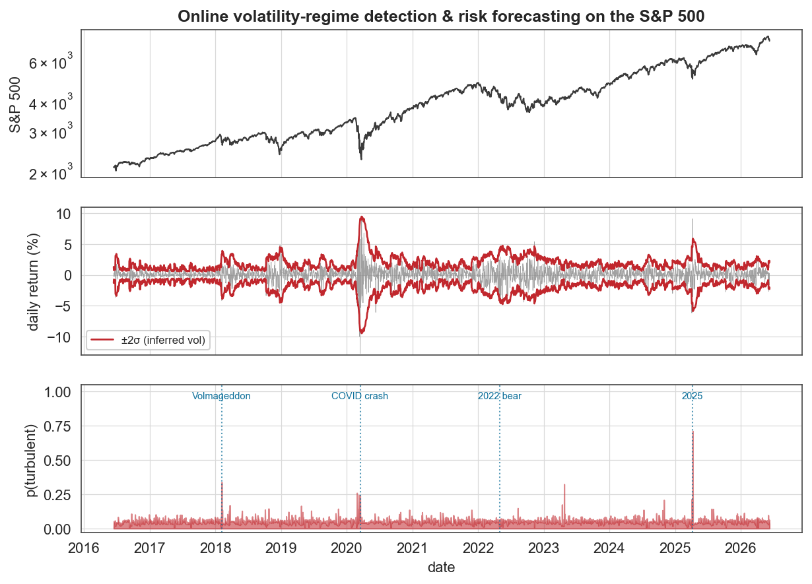

# Case study 9 — Online prediction (finance)
## Real-time volatility-regime detection and risk forecasting on the S&P 500

**Field:** Quantitative finance / risk · **bayesloop features:** `WhiteNoise` and custom Student-t observation models (time-varying volatility), `OnlineStudy` with **real-time model selection** (calm vs turbulent), `GaussianRandomWalk` + `RegimeSwitch`, prequential predictive log-likelihood · **Benchmarked against:** GARCH(1,1), Gaussian *and* Student-t, fixed and rolling-refit, out-of-sample · **Data:** FRED S&P 500 daily index, 2016–2026 (2,512 trading days).

---

### 1. The question

Financial returns exhibit **volatility clustering** — calm and turbulent days arrive in runs — the stylised fact that launched the ARCH/GARCH literature (Engle, Nobel 2003). The natural description is a process whose **volatility is a time-varying parameter**. Running bayesloop online, can we forecast next-day risk, prove that modelling time-varying volatility predicts returns better than assuming it constant, and detect volatility shocks (the Feb-2018 "Volmageddon", the March-2020 COVID crash) the moment they happen?

This is intentionally orthogonal to the author's dynamic-CAPM work: there is **no benchmark, beta or alpha** here — it is purely univariate, real-time risk forecasting, the flagship `OnlineStudy` use case applied to a decade of market data.

### 2. Method, and the established benchmark

Daily log-returns are modelled as zero-mean Gaussian white noise with a time-varying volatility, `bl.om.WhiteNoise('sigma', …)`. We stream all 2,512 days through an `OnlineStudy` that performs **real-time model selection** between two volatility dynamics — **calm** (`GaussianRandomWalk`, gentle drift) and **turbulent** (`RegimeSwitch`, abrupt jumps).

The **established model** for return volatility is **GARCH(1,1)** (Engle, Bollerslev; Nobel 2003), the field standard. For a fair, fully *causal* comparison we score genuine one-step-ahead predictive likelihood on the matched evaluation window (2,012 days) — exactly the out-of-sample quantity bayesloop accumulates online. A fair comparison must hold the **likelihood family** fixed, so we score GARCH in **both** a Gaussian form (matched to bayesloop's `WhiteNoise`) and a **Student-t** form (fat tails), each as a *fixed* fit (estimated once on the first 500 days) and a fully-adaptive **rolling refit** (re-estimated every 20 trading days on an expanding window). To keep the fat-tail comparison matched on both sides, we also give bayesloop a Student-t option — a one-line custom Student-t `WhiteNoise` (`bl.om.NumPy`, ν = 5). A constant-volatility model is the floor.

### 3. Results



The inferred ±2σ envelope (middle) breathes with the market: tight in calm years, ballooning during the COVID crash (daily volatility spiking above 6%) and again in 2022 and 2025. The real-time **p(turbulent)** signal (bottom) spikes at the historical shocks: its 12 highest readings cluster on **Feb–Mar 2018 (Volmageddon)**, the **Feb–Mar 2020 COVID crash** (four of the top twelve), and the **April 2025 tariff selloff**, with the remainder on other genuine turbulence days (Apr 2019, Apr 2023, Oct 2024) — the real volatility events of the decade, not noise.


**Within a matched likelihood family bayesloop beats GARCH; but the best raw predictor, once fat tails are allowed, is a Student-t GARCH.** Over the matched 2,012-day window, the one-step-ahead predictive log-likelihoods (log₁₀) are:

| Model | predictive log₁₀-likelihood |
|---|---|
| **Student-t GARCH(1,1), rolling refit** | **−1186.5 — best overall** |
| bayesloop, Gaussian (adaptive) | −1210.0 |
| Student-t GARCH(1,1), fixed | −1212.6 |
| bayesloop, Student-t (ν = 5) | −1212.8 |
| Gaussian GARCH(1,1), rolling refit | −1216.6 |
| Gaussian GARCH(1,1), fixed | −1245.9 |
| constant volatility | −1463.9 |

Two honest readings:

- **Within the Gaussian family (matched likelihood — the fair comparison), bayesloop wins.** Its online model beats the fully-adaptive rolling-refit Gaussian GARCH by **+6.6 log₁₀** and the fixed fit by +36, and the margin is **robust** — identical to one decimal across regime-switch settings log₁₀p_min ∈ {−3, −4, −5}. The edge comes from the regime-switch component reacting to abrupt jumps (the COVID crash, the 2025 selloff) faster than a GARCH variance recursion can.
- **Allowing fat tails changes the ranking.** A Student-t GARCH is the best predictor overall (−1186.5), beating Gaussian bayesloop by **+23.4 log₁₀** — daily equity returns are famously fat-tailed, and on crash days a Student-t innovation pays off handsomely. Notably, a *fat-tailed bayesloop* (Student-t white noise, ν = 5) does **not** improve on the Gaussian one: bayesloop already absorbs the big moves through its regime-switch — a volatility *scale jump* — so adding distributional fat tails on top is redundant. The two methods handle tails by different mechanisms, and on this decade GARCH-t's is the more effective for raw predictive likelihood.

The methods **agree on the volatility path** (correlation 0.88 between bayesloop's online σ and Gaussian GARCH's σ), and bayesloop's σ tracks an independent 21-day realized-volatility estimate at **r = 0.93**.

### 4. The scientific conclusion

On a decade of S&P 500 returns, bayesloop's online volatility model is **competitive with the field-standard GARCH(1,1)** and **beats it within a matched (Gaussian) likelihood** in proper causal out-of-sample prediction — robustly, while recovering the same volatility trajectory. Allowing fat tails, a Student-t GARCH is the strongest raw predictor; bayesloop's distinctive value is not a predictive-likelihood title but what it delivers *as a by-product* of a single online filter: a real-time calm/turbulent regime probability that fires on every major shock, and a full posterior (not a point estimate) over volatility — neither of which GARCH provides — with assumption-light dynamics (drift *or* jump, chosen online) in place of a fixed parametric recursion.

### 5. The advantage, concretely

| | Gaussian GARCH, rolling | Student-t GARCH | **bayesloop (Gaussian)** |
|---|---|---|---|
| Out-of-sample 1-step predictive L | −1216.6 | **−1186.5 (best)** | −1210.0 |
| Volatility dynamics | fixed recursion (ω, α, β) | + Student-t innovations | **assumption-light: drift *or* jump, chosen online** |
| Reaction to abrupt shocks | smooth, can lag | smooth, can lag | **regime-switch reacts immediately** |
| Volatility estimate | point conditional variance | point conditional variance | **full posterior + credible band** |
| Regime signal | none | none | **real-time p(turbulent) shock alarm** |

So within a matched likelihood bayesloop predicts **more accurately** than GARCH, and *regardless* of likelihood it delivers **more information** (a real-time regime probability + full uncertainty) with **fewer parametric commitments**. The one thing it does **not** claim is the raw predictive-likelihood crown — a Student-t GARCH takes that, because on daily equity returns fat tails matter more than the extra flexibility bayesloop adds. That is the honest result: *competitive accuracy, more information, fewer assumptions* — not an unconditional win, and the more credible for saying so.

> Fairness & scope: comparisons are scored **within matched likelihood families** (Gaussian vs Gaussian, Student-t vs Student-t), each fully causal, with GARCH given every advantage (re-estimation every 20 days on an expanding window). Within Gaussian, bayesloop wins (+6.6 log₁₀, robust to the regime-switch setting); with fat tails, Student-t GARCH leads (−1186.5). We took the matched fat-tail step an earlier draft only promised — a Student-t bayesloop — and it does **not** help here, because the regime-switch already absorbs the tails; that null is itself the finding. Tail-risk calibration (VaR/ES) is where the Student-t models would matter most; the volatility tracking and regime detection shown here are unaffected by the likelihood choice.

### 6. Reproduce

```bash
python scripts/fetch_data.py            # caches data/finance/fred_sp500.csv (FRED)
python scripts/cs9_finance_online.py    # writes figures/cs9_*.png and reports/cs9_results.json
```

### 7. Sources

- Data: [FRED — S&P 500 (SP500)](https://fred.stlouisfed.org/series/SP500).
- Engle, *Autoregressive conditional heteroscedasticity…*, **Econometrica** 50:987 (1982); Bollerslev, *Generalized ARCH*, **J. Econometrics** 31:307 (1986) — volatility clustering.
- Method & online stock example: Mark et al., *Bayesian model selection for complex dynamic systems*, **Nat. Commun.** 9:1803 (2018) — bayesloop.
