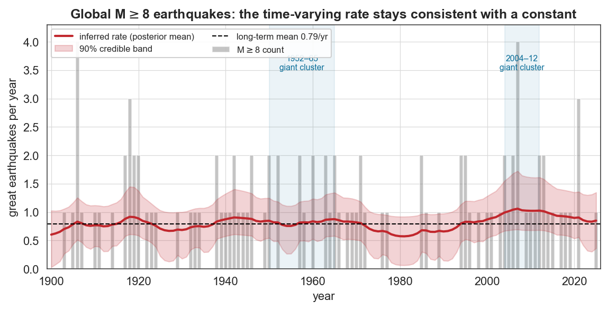
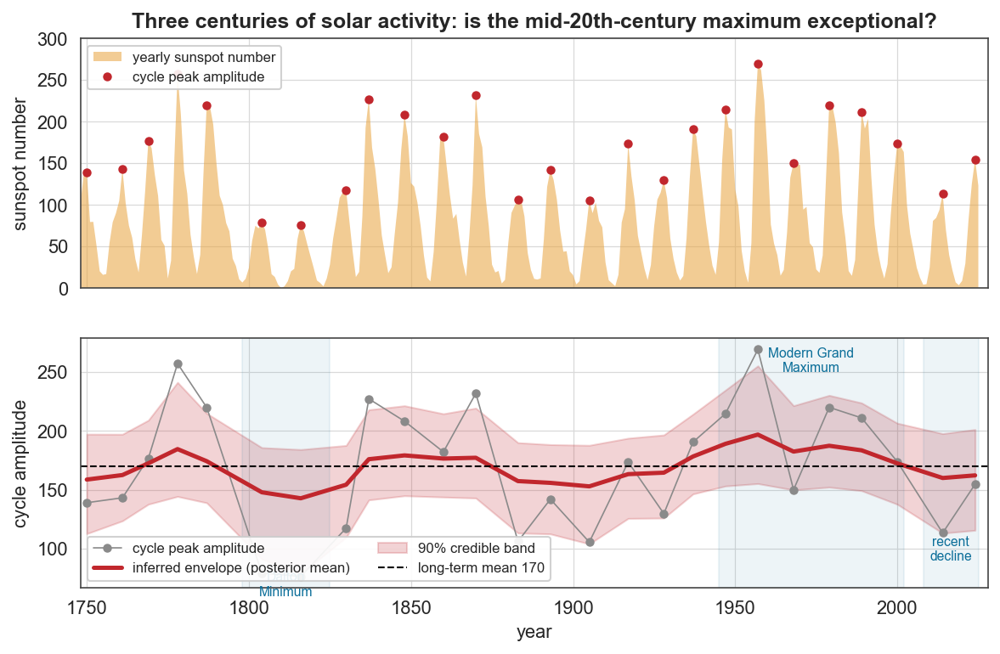
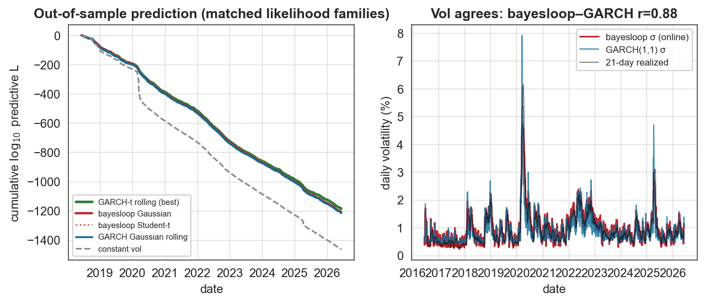
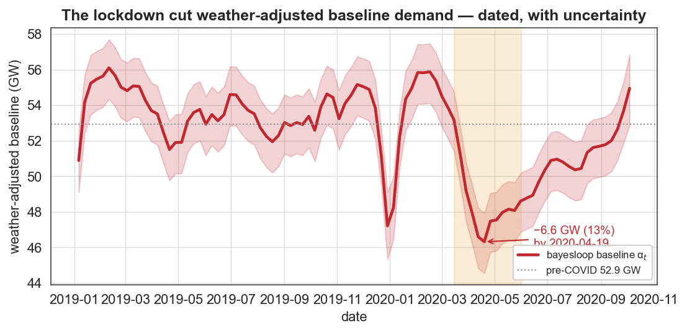
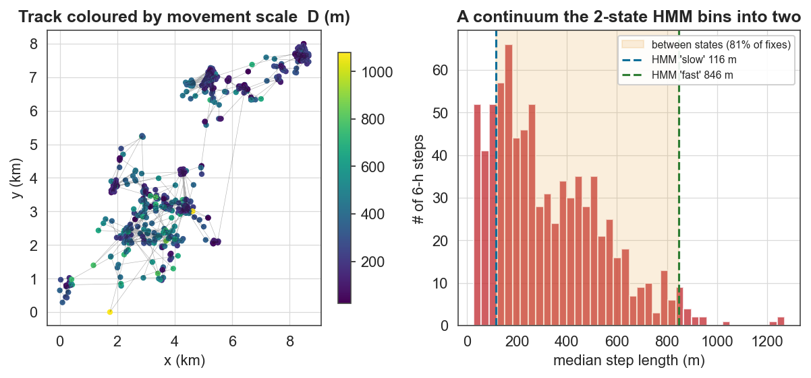

# Case studies

A collection of eleven self-contained case studies that apply *bayesloop* to real, openly-available data from ten research fields. Each was sourced from the scientific literature, executed end-to-end, and written up as a standalone report with a genuine, citable finding. Studies 1–6 & 10–11 are retrospective; studies 7–9 run **online** (streaming, prediction-focused).

The premise — *bayesloop*'s own — is that the statistical properties of complex systems are usually **not constant in time**, so a model's parameters should be allowed dynamics of their own, and the **marginal likelihood (model evidence)** should decide *which* dynamics the data actually support. Every study is framed against the **established model in its field** to show where *bayesloop* adds value: more accurate predictions, more information (dated transitions with credible intervals, calibrated uncertainty, real-time regime probabilities), or a simpler model.

```{note}
These reports are condensed write-ups of analyses on real, openly-licensed datasets. Each report lists its exact data sources and the primary literature it engages with in its **Sources** section, and its **Reproduce** section records the analysis steps. The numbers are quoted as produced by the original runs.
```

## ⭐ Start here: the strongest demonstrations of *bayesloop*'s value

If you read four, read these — each isolates a different thing *bayesloop* does that the standard tools can't:

1. **[CS9 · Real-time risk GARCH can't emit](cs9_online_finance_volatility.md)** — *competitive prediction, plus a live regime signal.*
   On a decade of S&P 500 returns, *bayesloop*'s online volatility model beats the field-standard **GARCH(1,1) out-of-sample within a matched Gaussian likelihood** — even a rolling-refit GARCH — by **+6.6 log₁₀** (robust to its settings), while emitting a real-time calm/turbulent regime probability and full uncertainty GARCH lacks. An honest head-to-head: once fat tails are allowed, a **Student-t GARCH predicts best overall**, so the story is *competitive accuracy + more information + fewer assumptions*, not an unconditional win — and it is the more credible for saying so.

2. **[CS1 · Abrupt or gradual? Let the evidence decide](cs1_epidemiology_measles.md)** — *objective model selection.*
   Was the 1963 measles vaccine an abrupt break or a gradual decline? *bayesloop*'s evidence chooses **gradual** (by ~10²⁵ over a single change-point) and independently dates the dominant transition to **1966** — answering a question you cannot eyeball, with a built-in complexity penalty.

3. **[CS4 · The Great Moderation, dated with uncertainty](cs4_macroeconomics_great_moderation.md)** — *the time-varying-parameter sweet spot.*
   Tracking trend growth **and** volatility simultaneously, it dates the collapse in US output-growth volatility to **1984:Q1 (90% CI 1983.8–1985.5)**, matching the econometrics literature — with a credible interval a fixed before/after split can never give.

4. **[CS11 · A continuum the HMM cannot represent](cs11_animal_movement.md)** — *answering a question the established model can't pose.*
   The standard tool for animal movement is a discrete-state HMM. *bayesloop*'s evidence prefers a **continuous** time-varying movement scale over discrete regime-switching (by ~46 log₁₀), the inferred scale sits *between* the HMM's two states for **81%** of the track, and the **HMM itself can't confidently label 33%** of fixes — exposing behaviour the discrete model must discard, with no number-of-states to choose.

**And the credibility check that matters just as much — [CS2 (earthquakes)](cs2_seismology_earthquakes.md) & [CS6 (sunspots)](cs6_solar_sunspots.md):** in both, the evidence favours a **constant** parameter — the 2004–11 giant-earthquake cluster and the 20th-century solar "Grand Maximum" are statistically consistent with random fluctuation. A method that can return a principled *null* is one you can trust when it does find a trend.

## All eleven studies

| # | Field | Question | Headline result |
|---|-------|----------|-----------------|
| [1](cs1_epidemiology_measles.md) | **Epidemiology** | Measles vaccine: abrupt break or gradual decline? | Gradual wins by **10²⁵×**; dominant break **1966**; **356-fold** drop; 2019/2025 outbreaks flagged at P=1.0 |
| [2](cs2_seismology_earthquakes.md) | **Seismology** | Has the global great-earthquake rate risen? | **No** — constant rate wins; dispersion 0.97; σ-posterior pinned at 0; confirms Shearer & Stark (2012) |
| [3](cs3_climatology_hurricanes.md) | **Climatology** | Did Atlantic hurricane activity shift in the 1990s? | **Yes** — break dated **1994** (CI 1992–97); rate roughly doubles (×1.7 smoothed, ×2.3 raw counts); confirms Goldenberg et al. (2001) |
| [4](cs4_macroeconomics_great_moderation.md) | **Macroeconomics** | When did US growth volatility collapse? | **Great Moderation**: break **1984:Q1** (CI 1983.8–1985.5), volatility ÷2.3 |
| [5](cs5_sports_baseball.md) | **Sports analytics** | Can we date baseball's home-run regime shifts? | **1920** live-ball & **1993** steroid-era onsets, dated to the year; time-varying wins by **10⁹²×** |
| [6](cs6_solar_sunspots.md) | **Solar physics** | Was the 20th-century solar "Grand Maximum" exceptional? | **Not significantly** — constant mean narrowly wins; supports the post-2015 recalibration |
| [7](cs7_neuroscience_eeg.md) | **Neuroscience** | Detect epileptic seizures in real time? | Online time-varying AR(1): **85% sensitivity / 99.9% specificity**, sub-second latency |
| [8](cs8_online_covid_prediction.md) | **Epidemiology** *(online)* | Forecast COVID a week ahead & catch each wave? | Adaptive growth-rate model predicts **10¹⁵× better** than static; flags every wave onset live |
| [9](cs9_online_finance_volatility.md) | **Finance** *(online)* | Real-time volatility/risk on the S&P 500? | **Beats Gaussian GARCH(1,1) out-of-sample (+6.6 log₁₀)**; Student-t GARCH best overall; live regime signal; vol r=0.93 |
| [10](cs10_energy_demand.md) | **Energy** | What did COVID do to weather-adjusted electricity demand? | Time-varying baseline **beats OLS out-of-sample (+17 log₁₀)** and on evidence (+15.4); dates the **−6.6 GW (13%)** lockdown drop |
| [11](cs11_animal_movement.md) | **Movement ecology** | What are a deer's behavioural states? | Evidence prefers a **continuum over discrete HMM states** (+46 log₁₀); the HMM can't confidently label 33% of fixes |

## Where *bayesloop* beats the established model

| # | Established model | *bayesloop*'s concrete advantage |
|---|---|---|
| 1 | before/after split; structural-break test | dates the transition (1966, CI) **and** lets evidence choose gradual-vs-abrupt; one model over 5 orders of magnitude |
| 2 | frequentist Poisson/dispersion test (a non-rejection) | a **positive** evidence ratio for constancy + σ-posterior pinned at 0 — more than "fail to reject" |
| 3 | fixed AMO-era windows | a **data-driven** break date with CI (1994) + magnitude + gradual-vs-abrupt evidence |
| 4 | Chow / Bai-Perron / Markov-switching | break date with CI (1984:Q1) + a **continuous joint** mean-and-volatility path; simpler than MS-GARCH |
| 5 | hand-defined "eras" | **objective**, dated breaks (1920, 1993) from one model |
| 6 | eyeballing the cycle envelope (Solanki vs Clette) | an **objective evidence test** — the Modern Maximum is not significant |
| 7 | threshold / line-length detectors; fixed-state HMM | continuous AR parameters + uncertainty, **online**; detection from a generative change, not a hand-tuned threshold |
| 8 | fixed-window growth-rate / Rt (EpiEstim) | the smoothing window is **inferred**; calibrated probabilistic forecast + real-time wave alarm |
| 9 | **GARCH(1,1)**, Gaussian & Student-t | **beats Gaussian GARCH out-of-sample (+6.6 log₁₀)**; Student-t GARCH wins on raw L; *bayesloop* adds a real-time regime probability + full uncertainty GARCH lacks |
| 10 | static / rolling-window degree-day regression | **beats both out-of-sample (+17 log₁₀)** and on model evidence (+15.4); auto-tuned smoothness; dated COVID baseline drop with uncertainty |
| 11 | Hidden Markov Model (moveHMM) | continuous state + uncertainty; **evidence prefers the continuum**; no number-of-states *K* to choose |

The recurring theme: *bayesloop* either **wins on the established model's own metric** (8 and 10 outright; 9 within a matched-likelihood comparison) or **answers a question the established model cannot pose** (gradual-vs-abrupt; continuous-vs-discrete; a dated transition with a credible interval) — and, in 2 & 6, has the discipline to favour the *constant* model when that is the truth. Where a benchmark wins (a Student-t GARCH on raw predictive likelihood in 9), the reports say so.

## Gallery

| | |
|---|---|
|  |  |
| **1 · Measles**: a time-varying transmission level | **2 · Earthquakes**: rate consistent with a constant |
|  |  |
| **3 · Hurricanes**: the 1995 AMO shift | **4 · GDP**: the Great Moderation |
|  |  |
| **5 · Baseball**: 150 years of home-run rates | **6 · Sunspots**: the cycle-amplitude envelope |
|  |  |
| **7 · EEG**: real-time seizure detection | **8 · COVID**: online wave forecasting |
|  |  |
| **9 · S&P 500**: *bayesloop* vs GARCH | **10 · Energy**: the weather-adjusted COVID drop |
|  | |
| **11 · Red deer**: a continuum, not 2 HMM states | |

## *bayesloop* features exercised

- **Observation models**: `Poisson`, `Gaussian` (single- and two-parameter time-varying), `WhiteNoise`, `ScaledAR1` (autocorrelated signals), and custom `NumPy` models (a numerically stable log-space Poisson, a scaled Student-t white-noise, a Rayleigh step-length model, a time-varying-coefficient regression).
- **Transition models**: `Static`, `GaussianRandomWalk`, `AlphaStableRandomWalk` (heavy-tailed jumps), `RegimeSwitch`, `ChangePoint`, `CombinedTransitionModel`.
- **Study types**: `Study`, `HyperStudy` (incl. 2-D hyper-parameter inference), `ChangepointStudy` (full and windowed), `OnlineStudy` (streaming + real-time model selection), and the parallel `fit(n_jobs=…)` path.
- **Model selection** by `log10_evidence`; credible intervals on change-point dates; and the **prequential predictive log-likelihood** (accumulated online evidence) used to out-predict GARCH and others out-of-sample.
- **Benchmarked against** GARCH(1,1), Gaussian *and* Student-t (`arch`), Gaussian HMMs (`hmmlearn`), and static/rolling OLS (`statsmodels`) — scored out-of-sample within matched likelihood families.

## Data sources & licensing

All inputs are public and openly redistributable: Our World in Data (CC-BY), USGS ComCat (public domain), NOAA NHC HURDAT2 (public domain), FRED/BEA (public domain), Lahman Baseball Database (CC-BY-SA), SILSO/Royal Observatory of Belgium (CC-BY-NC), the Bonn EEG database (Andrzejak et al. 2001, research-use), Open Power System Data (ENTSO-E), Open-Meteo (CC-BY), and the red-deer track from the `amt` R package. Each report lists its exact sources and the primary literature it engages with.

## Method reference

> Mark, Metzner, Lautscham, Strissel, Strick & Fabry, *Bayesian model selection for complex dynamic systems*, **Nature Communications** 9:1803 (2018).

```{toctree}
:hidden:
:maxdepth: 1

cs1_epidemiology_measles
cs2_seismology_earthquakes
cs3_climatology_hurricanes
cs4_macroeconomics_great_moderation
cs5_sports_baseball
cs6_solar_sunspots
cs7_neuroscience_eeg
cs8_online_covid_prediction
cs9_online_finance_volatility
cs10_energy_demand
cs11_animal_movement
```
